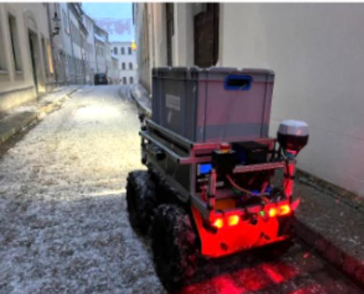
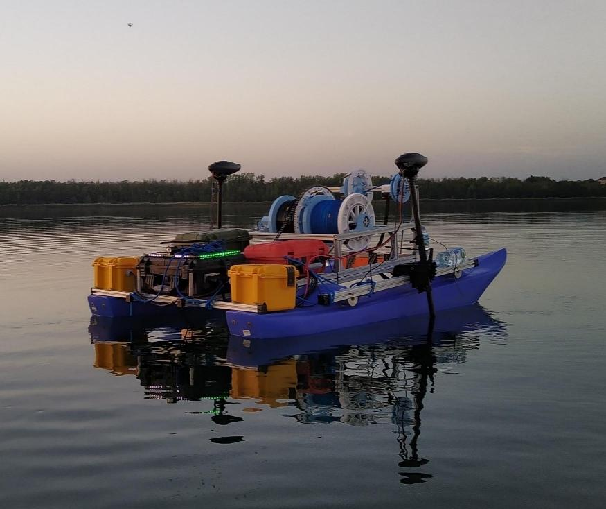

<!--
author:   Sebastian Zug; André Dietrich

email:    sebastian.zug@informatik.tu-freiberg.de

version:  0.1.0

language: en

narrator: UK English Female

icon:     https://media.aubi-plus.com/institution/thumbnail/3f3de48-technische-universitaet-bergakademie-freiberg-logo.jpg

link:     style.css

import:   https://raw.githubusercontent.com/liaTemplates/ABCjs/main/README.md
          https://raw.githubusercontent.com/liaTemplates/AVR8js/main/README.md
          https://raw.githubusercontent.com/liaTemplates/TextAnalysis/main/README.md
          https://raw.githubusercontent.com/LiaScript/CodeRunner/master/README.md
-->

[](https://liascript.github.io/course/?https://raw.githubusercontent.com/Cross-Lab-Project/presentations/main/Berufsschulen_2024/presentation.md#1)

# Digitale Labore in der beruflichen Bildung

<h2>Konzepte und Erfahrungen des CrossLab-Projektes </h2>

<div style="width: 34%; float: left">

| Partner                  |
|--------------------------|
| TU Bergakademie Freiberg |
| TU Ilmenau               |
| TU Dortmund              |
| Nordakademie             |

</div>

<!-- style="width: 65%; float: right" -->

<h5><p>Prof. Dr. Sebastian Zug</p><p>Berufsschulzentrum Freiberg</p><p> Januar 2024</p></h5>

<h5> </h5>

<div>

---

> Dieser Vortrag ist eine Open Educational Resource (OER) und steht unter der Lizenz [CC BY 4.0](https://creativecommons.org/licenses/by/4.0/deed.de). Alle enthaltenen Inhalte können frei verwendet werden und sind unter https://github.com/Cross-Lab-Project/presentations/tree/main/Berufsschulen_2024 verfügbar

</div>

## Motivation

Arbeitsgruppe Softwaretechnologie und Robotik - TU Bergakademie Freiberg

+ __Forschungsfeld 1: Robotik__

   
   

{{1-2}}
> Wie vermittelt man technische Fragestellungen, die einen hohen Hardwareaufwand benötigen?

             {{1-2}}
***********************************

+ __Forschungsfeld 2: Digitale Lehre__

    Die Arbeitsgruppe entwickelt LiaScript und Edrys als Open Source Lernplattformen für die digitale Lehre.

***********************************

### Vision Remote-Labore

                        {{0-1}}
************************************************************

__Mission:__
_Vergrößern Sie den Abstand zwischen Lernendem und Technik :-)._

<!-- width="40%" -->

> __Definition:__
> Remote-Labore ermöglichen den Zugriff auf echte Hardware über das Internet, ohne sich physisch in der Nähe der tatsächlichen Geräte aufzuhalten.

************************************************************

                        {{1-2}}
************************************************************

Umsetzung eines Remote-Labors 

")
")


!?[Industrial eLab - Demo](https://www.youtube.com/watch?v=bICfKRyKTwE "eLab - Labor mit Fernzugriff an der Otto-von-Guericke-Universität Magdeburg")

<!-- class="highlight" -->
> __Projekt:__ [Industrial eLab Projekt - Industrial eLab](https://www.wihoforschung.de/wihoforschung/de/bmbf-projektfoerderung/foerderlinien/forschung-zur-digitalen-hochschulbildung/erste-foerderlinie-zur-digitalen-hochschulbildung/industrial-elab/industrial-elab_node.html), BMBF (2017-2020), TU Freiberg, Otto-von-Guericke Universität Magdeburg


************************************************************

                        {{2-3}}
************************************************************

| Vorteile                                                                                                              | Nachteile                                                                              |
| :--------------------------------------------------------------------------------------------------------------------- | :-------------------------------------------------------------------------------------- |
| Lernendenzentrische Umsetzung von praktischer Bildung im Labor - dauerhafte Verfügbarkeit                                |                                                                                       |
| Lernende arbeiten mit echter Hardware                                                                               |                                                                                       |
| Entwicklungsumgebung, die perfekt den Anforderungen entspricht                                                         |                                                                                       |
| Das Fernsystem ermöglicht die Anwendung von Lernanalysemethoden zur Verbesserung der Online-Anwendung und entsprechender Vorlesungen. | Keine unmittelbare Unterstützung durch Betreuer, vergleichbar mit traditionellen Übungen in einem Labor |
|                                                                                                                        | Technischer Aufwand für Installation und Wartung                                        |


<!-- class="reference" -->
> __Reference:__ 
> Anja Hawlitschek, Sarah Berndt, Sebastian Zug, André Dietrich
> _Iterative Adaption eines Remote-Labors unter Berücksichtigung des Feedbacks der Studierenden._
> [Link](https://www.wbv.de/shop/Iterative-Adaption-eines-Remote-Labors-unter-Beruecksichtigung-des-Feedbacks-der-Studierenden-6004804w145)


************************************************************

### ... ja aber


              {{0-1}}
***********************************

")<!-- style="width: 70%; display: block; margin-left: auto; margin-right: auto;"-->

> __Herausforderung 1: Fehlende Flexibilität__ - Aufgaben anpassen oder neue Beispiele einfügen - Nur für Experten

> __Herausforderung 2: Beschränkte Nutzung__ - in einzelnen Phasen des Jahres wurde das Labor äußerst intensiv genutzt, während es in anderen kaum Anwedung fand

> __Herausforderung 3: Beschränkte Sicht__ - der Fokus der Umsetzung lag vollständig auf Remote-Laboren. Andere digitale Formate wurden nicht berücksichtigt.

***********************************

## Ziele des CrossLab-Projektes
Lösungsansätze:

+ Trennung zwischen tatsächlichen Lerninhalte und technischer Umsetzung  
+ Kombination unterschiedlicher digitaler Formate (Simulation, Videos, Remote-Labore, ...)
+ Integration anpassbarer / wiederverwendbare Materialien
+ Offene Nutzungskonzepte 
+ Kollaborative Entwicklung mit verschiedenen Autoren
+ ...
$\sum = $ Offene Bildungsressourcen (OER)

> __Ziel 1__ - Textbasierte interaktive Lernmaterialien

> __Ziel 2__ - Konfigurierbare digitale Labore

> __Ziel 3__ - Serverlose Infrastruktur


### 1. Textbasierte interaktive Lernmaterialien

<!-- class="reference" -->
> __Reference:__
> Die vorliegende Präsentation ist ein textbasiertes OER - 
> [Project](https://github.com/Cross-Lab-Project/presentations/blob/main/GeCon_2023_Keynote/CrossLab_GeCon2023.md),
> [Editor](https://liascript.github.io/LiveEditor/?/edit/iEAmFjiDKaxKd5UeYwu2oXAk)

> __Definition:__ LiaScript ist ein Markdown-Dialekt, mit dem Sie interaktive Online-Kurse erstellen können. Das Material wird durch textuelle Inhaltsdarstellungen und semantische Annotationen bereitgestellt. Common Markdown wird mit interaktiven Elementen angereichert.

     {{0}}
Wenn Sie oben auf das Symbol für den Präsentationsmodus klicken, können Sie zwischen den Formaten _Lehrbuch_, _Präsentation_ und _Folien_ wählen.
Mit anderen Worten, ein Textdokument kann entweder als Buch oder als interaktive Präsentation zum Selbststudium verwendet werden, oder wir können den Folienmodus für unsere Vorlesungen nutzen.

      {{1}}
Ein **dicker** Absatz erstreckt sich
über zwei,
nein, drei Zeilen.

    --{{2}}--
Gefolgt von einer Liste:

      {{2}}
- Liste mit 

- Unterpunkte:

  1. Punkt A
  2. Punkt B  

      {{3}}
| Animal          | weight in kg | Lifespan years | Mitogen |
| --------------- | ------------:| --------------:| -------:|
| Mouse           |        0.028 |             02 |      95 |
| Flying squirrel |        0.085 |             15 |      50 |
| Brown bat       |        0.020 |             30 |      10 |
| Sheep           |           90 |             12 |      95 |
| Human           |           68 |             70 |      10 |


      {{4}}
??[Familienschacht, Freiberg, Germany](https://sketchfab.com/3d-models/familienschacht-freiberg-germany-7c7d30506c554385a4a4321366e2e601)

    --{{5}}--
Quizze sind mit der Notation auch selbsterklärend.

      {{5}}
*******************************************************************

Mögen Sie die Demo bis hier her?

- [( )] Holt mich nur bedingt ab ...
- [( )] Ich schaue es mir an, wenn ich Zeit habe.
- [(X)] Cool


*******************************************************************

      {{6}}
``` abc
% channel: 0
X:353
T: GLUECK AUF DER STEIGER KOEMMT
N: E1512
O: Europa, Mitteleuropa, Deutschland
R: Staende -, Bergmanns - Lied
M: 4/4
L: 1/16
K: G
 | G8F4A4 | G8z8 |
B8A4c4 | B8z4
G2A2 | B4B4B4A2B2 | c4A3AA4
A2B2 | c4c4c4B2c2 | d4B3BB4
A4 | G8F8 | G4e4d4
c2A2 | B8A8 | G8z8
```
@ABCJS.eval


      {{7}}
```
Playing games has always been thought to be important to
the development of well-balanced and creative children;
however, what part, if any, they should play in the lives
of adults has never been researched that deeply. I believe
that playing games is every bit as important for adults
as for children. Not only is taking time out to play games
with our children and other adults valuable to building
interpersonal relationships but is also a wonderful way
to release built up tension.
```
@Textanalysis.FULL

      {{8}}
**********************

<div id="example">
<wokwi-led color="red"   pin="13" label="13"></wokwi-led>
<wokwi-led color="green" pin="12" label="12"></wokwi-led>
<wokwi-led color="blue"  pin="11" label="11"></wokwi-led>
<wokwi-led color="blue"  pin="10" label="10"></wokwi-led>
<span id="simulation-time"></span>
</div>

``` cpp
byte leds[] = {13, 12, 11, 10};
void setup() {
  Serial.begin(115200);
  for (byte i = 0; i < sizeof(leds); i++) {
    pinMode(leds[i], OUTPUT);
  }
  Serial.print("Running Led started ... ");
}

int i = 0;
void loop() {
  digitalWrite(leds[i], HIGH);
  delay(250);
  digitalWrite(leds[i], LOW);
  i = (i + 1) % sizeof(leds);
}
```
@AVR8js.sketch(example)

**********************


### 2. - Konfigurierbare digitale Labore

     {{0-1}}
<section>

> Traditionelle Laborrealisierungen sind monolithisch und schwer anpassbar.

``` ascii

  Laboratory Level                   Monolithic
                          Server-Infrastructure          Learner's View
  n Instances   .--------------------------------.
                |                                |         m Instances 
                                                                 .
      +-----------------+         +-----------------+            .  
      | Instrumentation |░        |    Management   |░           .
      +--------.        |░        +--------.        |░  
 +-----------+  \       |░   +-----------+  \       |░   +----------------+
 | 👩🏻‍🔬 Actual  \  \      |--->|  Gateway   \  \      |--->|  Web Browser   |
 | Laboratory /  /      |<---|     🖥     /  /      |<---|      🧑‍💻        |
 +-----------+  /       |░   +-----------+  /       |░   +----------------+
      +--------'        |░        +--------'        |░   Student's Computer
      |                 |░        |                 |░
      +-----------------+░        +-----------------+░           .
        ░░░░░░░░░░░░░░░░░░          ░░░░░░░░░░░░░░░░░░           .
                   .                                             .
                   .
                   .                                             
```

<!-- class="reference" -->
> __Reference:__
> Ines Aubel et al
> _Adaptable Digital Labs - Motivation and Vision of the CrossLab Project_
> GeCon 2022
> [Link](https://www.researchgate.net/publication/365384986_Adaptable_Digital_Labs_-Motivation_and_Vision_of_the_CrossLab_Project)

</section>

        {{1-2}}
<section>

```ascii

            Existing                         Learning Scenario              
     Module Implementations                    Configuration             
         from the Web                           (from web)                   
               |                                     |         
               +------------------+------------------+    
                                  |
                                  v             
                        +-----------------+    
                        | Browser based   |░   
                        | Lab control     |░        
                        +--------.        |░     
                   +-----------+  \       |░
                   | 👩🏻‍🔬 Actual  \  \      |-->  
                   | Laboratory /  /      |<--
                   +-----------+  /       |░      
                        +--------'        |░      
                        |                 |░   
                        +-----------------+░              .
                          ░░░░░░░░░░░░░░░░░░              .

```


| [Modules](https://github.com/topics/edrys-module) | [Classrooms](https://github.com/Cross-Lab-Project/openLabs) |
| ------------------------------------------------- | ----------------------------------------------------------- |
| Collaboration (Chat, Video Call)                  | Micro-controller (based on arduino-cli)                     |
| Interaction (Whiteboard, Editors)                 | Programming environments for various languages              |
| Input/Output (Video stream, Console)              |                                                             |
| Teaching Materials (LiaScript)                    |                                                             |


<!-- class="highlight" -->
> __Project:__
> [Crosslab](https://stiftung-hochschullehre.de/projekt/crosslab/) - Flexibel kombinierbare Cross-Reality Labore in der Hochschullehre: zukunftsfähige Kompetenzentwicklung für ein Lernen und Arbeiten 4.0, Stiftung Innovation in der Hochschullehre (2021 - 2024) - TU Bergakademie Freiberg, TU Illmenau, TU Dortmund, Nordakademie

</section>


        {{1-2}}
<section>

```` yaml   edrys_arduino_example.yaml
id: 867h9k2xYapYq324ezDQX
createdBy: andredietrich@web.de
dateCreated: 1683560033614
name: Arduino Kurs
members:
  teacher:
    - andre.dietrich@informatik.tu-freiberg.de
    - sebastian.zug@informatik.tu-freiberg.de
    - test@web.de
    - andredietrich@web.de
  student: []
modules:
  - url: https://cross-lab-project.github.io/edrys_module-markdown-it/index.html
    config: >-
      # Was ist Arduino?


      Arduino ist eine Open-Source-Plattform für Elektronik-Projekte, die aus
      einer einfachen Hardware und einer benutzerfreundlichen Software besteht.

    showInCustom: lobby
    width: full
    height: tall
    ....  
````

> Demo: Laufendes Labor im Rahmen der Erstsemesterveranstaltung - Digitale Systeme

</section>

### 3. Serverlose Infrastruktur

> Remote-Labore für jedermann?

``` ascii
Bisheriges Serverbasiertes -Setup              Server-lose Peer-to-Peer Umsetzung
                          
      👨🏾‍💻 --.     .-- 👩‍💻                          - - - --👨🏾‍💻-----👩‍💻    
            \   /                                              /  \ 
                                                              /    \     
  👩‍💻 ------  🖥️  ------ 👨🏾‍💻                           👩‍💻------+-----👨🏾‍💻- - -    
                                                       \    /      /   
            /   \                                       \  /      /    
      👨🏾‍💻 --'     '-- 👩‍💻                                  👨🏾‍💻     👩‍💻- - - -    
```

> Demo: Ad-Hoc Remote-Labor


## Referenzen

| Reference                 | Link                                                                         |
| ------------------------- | ---------------------------------------------------------------------------- |
| Crosslab Projekt Webseite | [https://cross-lab.org/](https://cross-lab.org/)                             |
| Projekt Repository        | [https://github.com/Cross-Lab-Project](https://github.com/Cross-Lab-Project) |
| Edrys Repository          | [https://edrys.org/](https://github.com/Cross-Lab-Project/edrys)             |
| LiaScript                 | [https://LiaScript.github.io](https://LiaScript.github.io)                   |


> Presentation materials:
>
> + [https://github.com/Cross-Lab-Project/presentations/blob/main/GeCon_2023_Keynote/CrossLab_GeCon2023.md](https://github.com/Cross-Lab-Project/presentations/blob/main/GeCon_2023_Keynote/CrossLab_GeCon2023.md),
> + [https://liascript.github.io/LiveEditor/?/show/file/https://raw.githubusercontent.com/Cross-Lab-Project/presentations/main/GeCon_2023_Keynote/CrossLab_GeCon2023.md](https://liascript.github.io/LiveEditor/?/show/file/https://raw.githubusercontent.com/Cross-Lab-Project/presentations/main/GeCon_2023_Keynote/CrossLab_GeCon2023.md)

## Backup Slides

### Artificial Intelligence
    {{1}}
<section>

#### Generating online-courses with ChatGPT


</section>

    {{2}}
<section>

#### Try some prompts

``` markdown   Prompt excerpt for quizzes
Create quizzes using LiaScript syntax. There are four types of quizzes: Single-Choice, Multiple-Choice, Text-Quiz, and Gap-Text.

For Single-Choice Quiz:
- Each quiz consists of a question and four answer options.
- Only one answer option is correct.
- Use square brackets with round brackets inside to mark the answer options.
- Place an "X" inside the round brackets to indicate the correct answer option.
- Separate each quiz with a blank line.

...

**Single-Choice Quiz Example:**

Question: What is the capital of France?

- [( )] London
- [( )] Berlin
- [(X)] Paris
- [( )] Rome
...
```

---

__Demo:__ https://chat.openai.com/share/e3c0ad08-c561-4834-b5ca-b8402346f9e5

</section>

### Additional examples 

??[online circuit Simulator](https://falstad.com/circuit/circuitjs.html)

??[Chemical Simulation](https://phet.colorado.edu/sims/html/concentration/latest/concentration_all.html)

```csharp    CSharpHelloWorld.cs
Console.WriteLine("Hello, World!");
```
```xml       projectfile
<Project Sdk="Microsoft.NET.Sdk">

  <PropertyGroup>
    <OutputType>Exe</OutputType>
    <TargetFramework>net6.0</TargetFramework>
    <ImplicitUsings>enable</ImplicitUsings>
    <Nullable>enable</Nullable>
  </PropertyGroup>

</Project>
```
@LIA.eval(`["Program.cs", "project.csproj"]`, `dotnet build -nologo`, `dotnet run`)