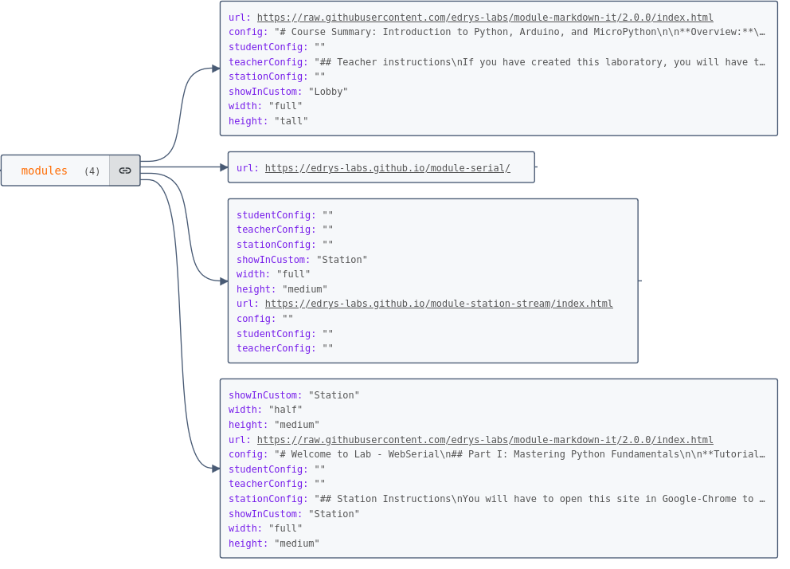
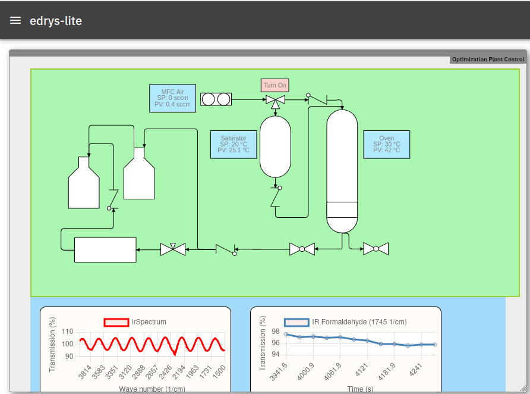
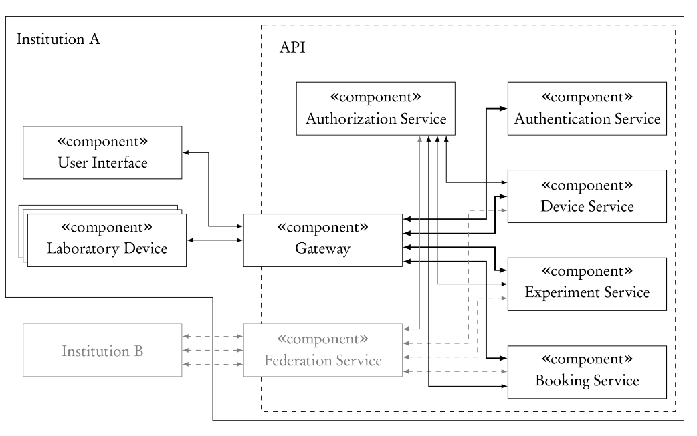
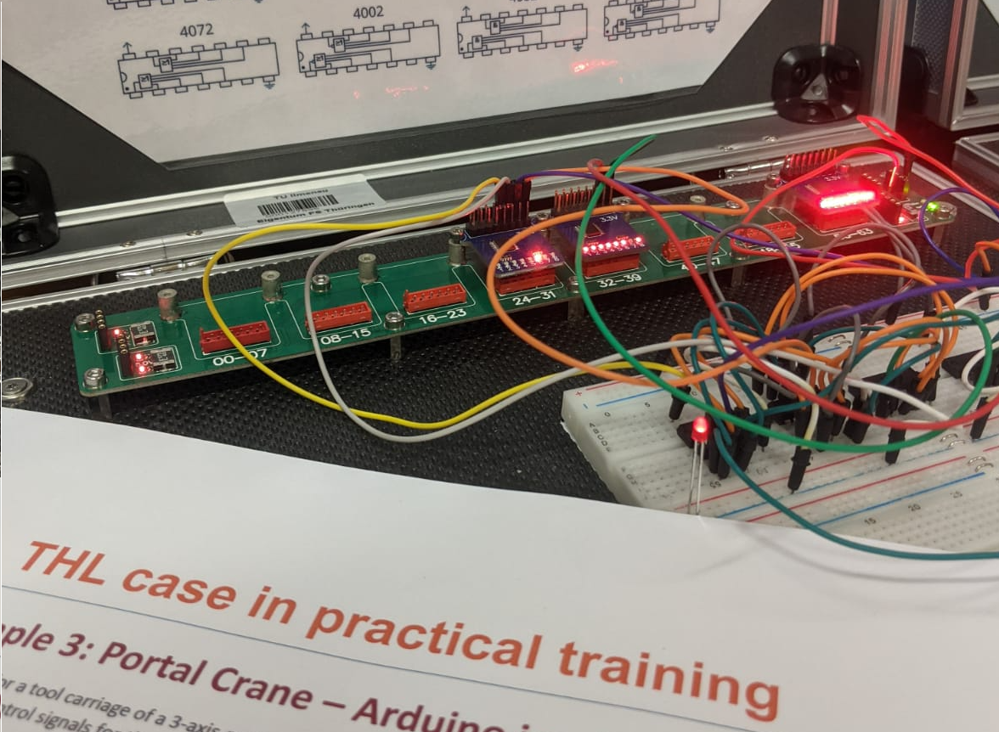
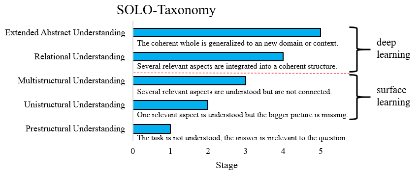
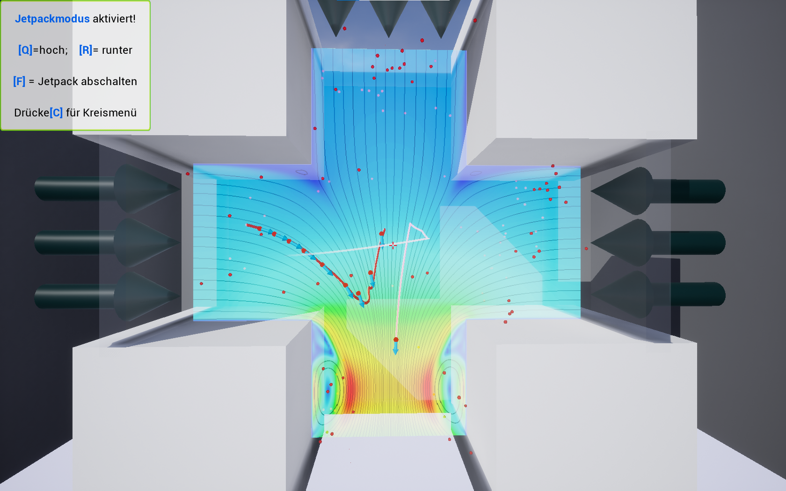
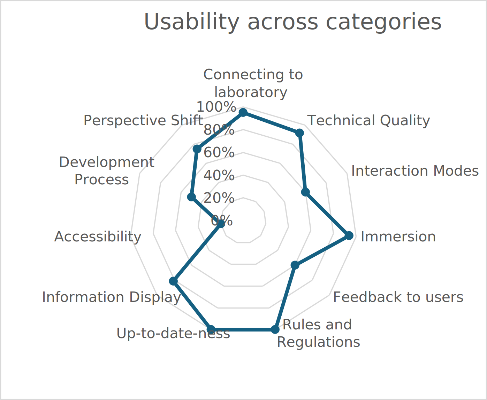
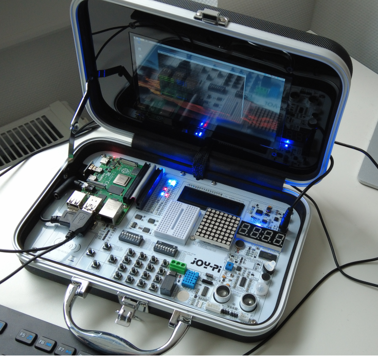

<!--
author:   Sebastian Zug; André Dietrich

email:    sebastian.zug@informatik.tu-freiberg.de

version:  0.0.2

language: en

narrator: UK English Female

icon:     https://media.aubi-plus.com/institution/thumbnail/3f3de48-technische-universitaet-bergakademie-freiberg-logo.jpg

link:     ./style.css

icon:     ./Logo_mehrfarbig.png

@style
.flex-container {
    display: flex;
    flex-wrap: wrap; /* Allows the items to wrap as needed */
    align-items: stretch;
    gap: 20px; /* Adds both horizontal and vertical spacing between items */
}

.flex-child { 
    flex: 1;
    margin-right: 20px; /* Adds space between the columns */
}

@media (max-width: 600px) {
    .flex-child {
        flex: 100%; /* Makes the child divs take up the full width on slim devices */
        margin-right: 0; /* Removes the right margin */
    }
}
@end

-->

[](https://raw.githubusercontent.com/Cross-Lab-Project/presentations/refs/heads/main/Dortmund_Friends_2024/CrossLab_Friends.md)

# Adaptable Digital Labs

Motivation and Results of the CrossLab Project
----------------------------------------------

<section class="flex-container">

<!-- class="flex-child" style="min-width: 250px;" -->
> __Project:__
> [Crosslab](https://stiftung-hochschullehre.de/projekt/crosslab/) - _Flexibel kombinierbare Cross-Reality Labore in der Hochschullehre: zukunftsfähige Kompetenzentwicklung für ein Lernen und Arbeiten 4.0, Stiftung Innovation in der Hochschullehre (2021 - 2024)_
> 
> * TU Bergakademie Freiberg
> * TU Ilmenau
> * TU Dortmund
> * Nordakademie Elmshorn

<!-- class="flex-child" style="min-width: 250px;" -->


</section>

--------------------------------------------

## CrossLab-Motivation

")<!-- style="width: 90%; display: block; margin-left: auto; margin-right: auto;"-->

> __How to characterize the implementation? It was hard coded related to components and content.__

### Cross-X Vision

```ascii


                            +--------------------------------------------------------+
         +-->    elements   | composition of varying laboratory objects              |
         |                  +--------------------------------------------------------+
         |
         |                  +--------------------------------------------------------+
         +-->       types   | mixture of different types of laboratories             |
         |                  +--------------------------------------------------------+
CROSS ---+
         |                  +--------------------------------------------------------+
         +--> disciplinary  | sharing laboratories between different disciplines     |
         |                  +--------------------------------------------------------+
         |
         |                  +--------------------------------------------------------+
         +-->   university  | formation of a laboratory cluster                      |
                            +--------------------------------------------------------+
                                                                                                          .
```

### Challenges

```ascii

                             .--------------.   .--------------.   .--------------.
                             | technical    |   | didactical   |   |organisational|
                             |              |   |              |   |              |
                            +--------------------------------------------------------+
         +-->    elements   | composition of varying laboratory objects              |
         |                  +--------------------------------------------------------+
         |                   |              |   |              |   |              |
         |                  +--------------------------------------------------------+
         +-->        types  | mixture of different types of laboratories             |
         |                  +--------------------------------------------------------+
CROSS ---+                   |              |   |              |   |              |
         |                  +--------------------------------------------------------+
         +->  disciplinary  | sharing laboratories between different disciplines     |
         |                  +--------------------------------------------------------+
         |                   |              |   |              |   |              |
         |                  +--------------------------------------------------------+
         +-->   university  | formation of a laboratory cluster                      |
                            +--------------------------------------------------------+
                             |              |   |              |   |              |
                             .--------------.   .--------------.   .--------------.
                                                                                                          .
```

### Requierments

```ascii


                              |  technical     |  didactical     |  organisational
                 -------------+----------------+-----------------+------------------
                              | data exchange, | adjustment of   |
         +-->       elements  | real-time      | system recon-   |
         |                    | behaviour      | figuration      | digital skills
         |       -------------+----------------+ and intended    | of lecturers
         |                    | individual     | didactical      |
         +-->           type  | interfaces     | learning        |
         |                    | composability  | outcomes        |
CROSS ---+       -------------+----------------+-----------------+------------------
         |                    | remote re-     | specific        | access planning,
         +-->    disciplinary | configura-     | learning per-   | physical re-
         |                    | bility         | spectives       | configuration
         |       -------------+----------------+-----------------+ privacy,
         |                    | student access | differnt didac- | maintance and
         +-->      university |                | tical profiles  | monitoring
                              |                | and formalisms  |
                 -------------+----------------+-----------------+------------------
                                                                                                           .
```

## Solutions

<iframe src="https://giphy.com/embed/l0MYODQzHE3ibZ62A" width="480" height="360" style="" frameBorder="0" class="giphy-embed" allowFullScreen></iframe><p><a href="https://giphy.com/gifs/vintage-chemistry-lab-l0MYODQzHE3ibZ62A">via GIPHY</a></p>

### TU Bergakademie Freiberg

<section class="flex-container">

<div class="flex-child" style="min-width: 250px;">

__Remote Labs as Open Educational Ressoureces__



</div>

<div class="flex-child" style="min-width: 250px;">

__Available Demos: Chemical Lab / Robotics Lab / Computer Science Lab__



</div>

</section>

<!-- class="reference" -->
> __Reference:__ 
> Ines Aubel, Sebastian Zug, Martin Bertau
> _Potential of Innovative Concepts STEM Education for Industry 4.0: CrossLab an Example._ Chemie Ingenieur Technik, 2024
> [Link](https://onlinelibrary.wiley.com/doi/10.1002/cite.202400114)


### TU Illmenau

<section class="flex-container">

<div class="flex-child" style="min-width: 250px;">

__Remote Labs as Systems of Systems__



</div>

<div class="flex-child" style="min-width: 250px;">

__Available Demos: Take away lab__



</div>

</section>

<!-- class="reference" -->
> __Reference:__ 
> Johannes Nau, Marcus Soll, _An Extendable Microservice Architecture for Remotely Coupled Online Laboratories._ In: Auer, M.E., Langmann, R., Tsiatsos, T. (eds) Open Science in Engineering. REV 2023. Lecture Notes in Networks and Systems, Springer, 2023 
> [Link](https://doi.org/10.1007/978-3-031-42467-0_9)

### TU Dortmund

<section class="flex-container">

<div class="flex-child" style="min-width: 250px;">

__Taxonomies for (Remote) Laboratories__



</div>

<div class="flex-child" style="min-width: 250px;">

__Available Demos: AR/VR laboratories for fluid mechanics__



</div>

</section>

<!-- class="reference" -->
> __Reference:__ 
> Online Laboratories in Higher Engineering Education: Solutions, challenges, and future directions from a pedagogical perspective. European Journal of Engineering Education, Volume 48, Issue 5 (2023). Special Issue, guest edited by: Dominik May, Claudius Terkowsky, Valérie Varney and David  
> [Link](https://www.tandfonline.com/toc/ceee20/48/5)

### Nordakademie

<section class="flex-container">

<div class="flex-child" style="min-width: 250px;">

__Usability analysis for Remote Laboratories__



</div>

<div class="flex-child" style="min-width: 250px;">

__Available Demos: Embedded Systems__



</div>

</section>

<!-- class="reference" -->
> __Reference:__ 
> Kobras, Louis, Marcus Soll, Franziska Herrmann,  Annette Bock „Usability and User Experience Challenges of Cross Reality Laboratories Experienced by Creators“. Chemie Ingenieur Technik, Bd. 96, Nr. 11, November 2024, S. 1516–21. 
> [Link](https://doi.org/10.1002/cite.202400060)

## Referencess

<section class="flex-container">

<div class="flex-child" style="min-width: 250px;">

> Enjoy the meeting - looking forward to inspiring discussions!

| Reference                | Link                                                                         |
| ------------------------ | ---------------------------------------------------------------------------- |
| Crosslab Projekt Website | [https://cross-lab.org/](https://cross-lab.org/)                             |
| Project Repository       | [https://github.com/Cross-Lab-Project](https://github.com/Cross-Lab-Project) |

</div>

<div class="flex-child" style="min-width: 250px;">

{{1-2}}
!?[](./Robot-CrossLab_edit.mp4)<!--
autoplay="true"
muted="true"
-->

</div>

</section>