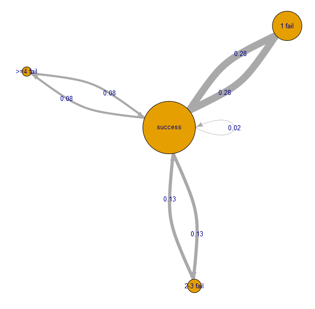

<!--
author:   Sebastian Zug; André Dietrich

email:    sebastian.zug@informatik.tu-freiberg.de

version:  0.0.1

language: en

narrator: UK English Female

icon:     https://cross-lab.org/content/images/2021/11/Logo-mit-5-mehrfarbig.png

link:     style.css

import:   https://raw.githubusercontent.com/liaTemplates/ABCjs/main/README.md
          https://raw.githubusercontent.com/liaTemplates/AVR8js/main/README.md
          https://raw.githubusercontent.com/liaTemplates/TextAnalysis/main/README.md
-->

[](https://liascript.github.io/course/?https://raw.githubusercontent.com/Cross-Lab-Project/presentations/main/GeCon_2023_Keynote/CrossLab_GeCon2023.md)


# Digital Laboratories as Open Educational Resources

<div class="left">

## Challenges and Solutions

---

Prof. Dr. Sebastian Zug

Institute of Computer Science

TU Bergakademie Freiberg

---

### IEEE German Education Conference 2023

### (GeCon 2023) Berlin, 3.08.2023

---

</div>

<div class="right">


</div>


## Motivation of the presentation

                    {{0-1}}
**************************************************

> Agenda of todays presentation as a timeline ...

`````````````````````````````````````````````````````


             Remote
           Laboratory                                       Digital
                                                             Laboratory
                                                              as OER
      ----------*-----                                       ----*----->
 Traditional                                                        Visions and
 Laboratory                                                          Challenges
 Concepts


 2014       2017               2020     2021                   2023


`````````````````````````````````````````````````````

**************************************************


                     {{1-2}}
**************************************************

> Agenda of todays presentation as a timeline, __as a research road map__

`````````````````````````````````````````````````````
                                   .------>
                            OER   /
             Remote       .------+-------->
           Laboratory    /        \                         Digital
                        /          .------>               \  Laboratory
                       /                                   \  as OER
      ----------*-----+                                     +----*----->
 Traditional           \                                   /        Visions and
 Laboratory             \                 .--->           /          Challenges
 Concepts                \               /
                          .-------------+
                            Digital      \
                            Laboratories  .------->


`````````````````````````````````````````````````````

**************************************************


                     {{2-4}}
**************************************************

> Agenda of todays presentation as a timeline, as a research road map and __as a sum of lessoned learned__.


`````````````````````````````````````````````````````
                                   .------>
                            OER   /
             Remote       .------+-------->
           Laboratory    /        \                      \  Digital
                        /          .-O---->               \  Laboratory
                       /             ^                     \  as OER
      --------O-*---O-+              |                      +----*----->
 Traditional  ^     ^  \            TP2                    /        Visions and
 Laboratory   |     |   \            |    .--->          -+          Challenges
 Concepts    TP0   TP1   \           v   /               /
                          .----------O--+
                            Digital      \
                            Laboratories  .-----o->
                                                ^
                                                | TP3
`````````````````````````````````````````````````````

**************************************************


                     {{3-4}}
**************************************************


| Turning Point | Identified requirements / drawbacks | Development goal                                      |
| :------------ | :---------------------------------- | ----------------------------------------------------- |
| TP0           |                                     | Remote Laboratory                                     |
| TP1           |                                     | Description Language for learning contexts            |
| TP2           |                                     | Seamless Integration of Laboratory Elements           |
| TP3           |                                     | Modularization / Adaptability of digital laboratories |

*******************************************

                     {{4-5}}
**************************************************

Auditorium's background 
----------------------------------------------

- [ ] Who of you has already implemented a remote laboratory?
- [ ] Who uses OER materials in his teaching?
- [ ] Who provides OER materials for others?

**************************************************


## TP 0 - Remote Laboratories

                        {{0-1}}
************************************************************

__Motivation of TP 0:__
_Increase the distance between student and laboratory equipment :-)._


> __Definition:__
> Remote laboratories provide an access to real hardware over the internet without being near the actual equipment.

************************************************************

                        {{1-2}}
************************************************************

| Advantages                                                                                                                             | Disadvantages                                                                             |
| :------------------------------------------------------------------------------------------------------------------------------------- | :---------------------------------------------------------------------------------------- |
| Student centric implementation of practical education in  laboratory - permanent availability                                          |                                                                                           |
| Students work with real hardware                                                                                                       |                                                                                           |
| Development environment perfectly matching the requirements                                                                            |                                                                                           |
| The remote system allows the application of learning analytics methods for improving the online appliction and corresponding lectures. | No immediate support by supervisors comparable to traditional exercises in a a laboratory |
|                                                                                                                                        | Technical efforts for installation and maintenance                                        |


<!-- class="highlight" -->
> __Project:__ Industrial eLab Projekt - Industrial eLab [BMBF](https://www.wihoforschung.de/wihoforschung/de/bmbf-projektfoerderung/foerderlinien/forschung-zur-digitalen-hochschulbildung/erste-foerderlinie-zur-digitalen-hochschulbildung/industrial-elab/industrial-elab_node.html) - TU Freiberg, Otto-von-Guericke Universität Magdeburg (2017-2020)

************************************************************

                        {{2-3}}
************************************************************

")
")


!?[Industrial eLab - Demo](https://www.youtube.com/watch?v=bICfKRyKTwE "eLab - Labor mit Fernzugriff an der Otto-von-Guericke-Universität Magdeburg")


<!-- class="reference" -->
> __Reference:__ 
> Anja Hawlitschek, Sarah Berndt, Sebastian Zug, André Dietrich
> _Iterative Adaption eines Remote-Labors unter Berücksichtigung des Feedbacks der Studierenden._
> [Link](https://www.wbv.de/shop/Iterative-Adaption-eines-Remote-Labors-unter-Beruecksichtigung-des-Feedbacks-der-Studierenden-6004804w145)

************************************************************


## TP1 - Concepts for variability and openness

                        {{0-1}}
************************************************************

> __Success, but ...__ Besides the technical efforts, the implementation did not provide any kind of adaptability:

+ technical solutions depended on the specific hardware
+ the implementation was not reusable for other learning contexts
+ ...
+ __the learning content was "hard coded" into the implementation__

************************************************************

                        {{1-3}}
************************************************************

> __Requierments__:
>
> + Separate handling of actual learning contents
> + Adaptable materials 
> + Reusable learning content 
> + Open to different authors 
> + ...
>     $\sum = $ Open Educational Ressources (OER)

__Motivation of TP 1:__  _Define a language not an environnement for Open Educational Resources._

************************************************************

                        {{2-3}}
************************************************************


`````````````````````````````````````````````````````
                                      text based
                                   .------>
                            OER   /   meta data
             Remote       .------+-------->
           Laboratory    /        \   obstacles             Digital
                        /          .------>                  Laboratory
                       /                                      as OER
      --------O-*---O-+                                      ----*----->
 Traditional  ^     ^                                               Visions and
 Laboratory   |     |                                                Challenges
 Concepts    TP0   TP1
`````````````````````````````````````````````````````


<!-- class="highlight" -->
> __Project:__
> MOER Projekt - Multi-Autoren-Tool für OER-Inhalte
> [BMBF](https://www.wihoforschung.de/wihoforschung/de/bmbf-projektfoerderung/foerderlinien/forschung-zur-digitalen-hochschulbildung/querschnittsprojekte/moer/moer_node.html) (2020) - TU Bergakademie Freiberg

<!-- class="highlight" -->
> __Project:__ 
> Programmieren im Team - DiP-iT
> [BMBF](https://www.wihoforschung.de/wihoforschung/de/bmbf-projektfoerderung/foerderlinien/forschung-zur-digitalen-hochschulbildung/dritte-foerderlinie-zur-digitalen-hochschulbildung/dip-it/dip-it_node) (2020-2023) - TU Bergakademie Freiberg, Otto-von-Guericke Universität Magdeburg, Humboldt Universität zu Berlin

************************************************************


### Text based learning materials - LiaScript

<!-- class="reference" -->
> __Reference:__
> The current presentation ist an OER too - 
> [Project](https://github.com/Cross-Lab-Project/presentations/blob/main/GeCon_2023_Keynote/CrossLab_GeCon2023.md),
> [Editor](https://liascript.github.io/LiveEditor/?/show/file/https://raw.githubusercontent.com/Cross-Lab-Project/presentations/main/GeCon_2023_Keynote/CrossLab_GeCon2023.md)

> __Definition:__ LiaScript is a Markdown dialect that allows you to create interactive online courses. The material is provided by textural content representations and semantic annotations. Common Markdown is enriched with interactive elements.

    --{{0}}--
We have attempted to expand the text format around Markdown to make it equally understandable and straightforward while meeting today's demands.
One advantage for us is that the same course can be consumed in different formats.
If you click on the icon for the presentation mode above, you can choose between the formats _textbook_, _presentation_, and _slides_.
In other words, a text document can be used either as a book or interactive presentation for self-study, or we can use the slides mode for our lectures.
And yes, most browsers have a Text-To-Speech Engine, which allows you to have comments and dialogues read out loud.

    --{{1}}--
First, the paragraph appears in a single line.

      {{1}}
A **thick** paragraph spans
across two,
no, three lines.

    --{{2}}--
Followed by the list.

      {{2}}
- List with

- Sub-points:

  1. Point
  2. Points  

      {{3}}
| Animal          | weight in kg | Lifespan years | Mitogen |
| --------------- | ------------:| --------------:| -------:|
| Mouse           |        0.028 |             02 |      95 |
| Flying squirrel |        0.085 |             15 |      50 |
| Brown bat       |        0.020 |             30 |      10 |
| Sheep           |           90 |             12 |      95 |
| Human           |           68 |             70 |      10 |

    --{{3}}--
Tables are internally analyzed to see if they potentially represent a dataset that can be visualized in different formats and interactively.

    --{{4}}--
If possible, external sources can also be embedded. Two preceding question marks before a link tell LiaScript to try everything possible to display the content in the document.

      {{4}}
??[Familienschacht, Freiberg, Germany](https://sketchfab.com/3d-models/familienschacht-freiberg-germany-7c7d30506c554385a4a4321366e2e601)

    --{{5}}--
Quizzes are also self-explanatory, we hope.

      {{5}}
*******************************************************************

How did you like the demo so far?

- [( )] Just okay ...
- [( )] Not impressive
- [(X)] Very good, but what's next?

---

Fill in the blanks and check your pronunciation!

      {{|>}}
The film that I saw [[(that)|those|these|then]] night wasn’t very good.
It was all [[ about ]] a man [[ who ]] built a
time machine so he [[ could ]] travel back in time.
It took him ages and ages [[ to ]] build the machine.


*******************************************************************

      {{6}}
``` abc
% channel: 0
X:353
T: GLUECK AUF DER STEIGER KOEMMT
N: E1512
O: Europa, Mitteleuropa, Deutschland
R: Staende -, Bergmanns - Lied
M: 4/4
L: 1/16
K: G
 | G8F4A4 | G8z8 |
B8A4c4 | B8z4
G2A2 | B4B4B4A2B2 | c4A3AA4
A2B2 | c4c4c4B2c2 | d4B3BB4
A4 | G8F8 | G4e4d4
c2A2 | B8A8 | G8z8
```
@ABCJS.eval


      {{7}}
```
Playing games has always been thought to be important to
the development of well-balanced and creative children;
however, what part, if any, they should play in the lives
of adults has never been researched that deeply. I believe
that playing games is every bit as important for adults
as for children. Not only is taking time out to play games
with our children and other adults valuable to building
interpersonal relationships but is also a wonderful way
to release built up tension.
```
@Textanalysis.FULL


### Meta data 

> __Definition__:
> Meta data for OER describe the content, quality, and conditions of use of a learning resource.


### Obstacles for OER  

The following list was extracted from a survey of 42 teachers at the TU Bergakademie Freiberg.
The study focuses on the obstacles for the use of OER in teaching.

{{1}}
- __Emotional Classification:__

  - "_Anyone can use my work for themselves!_"

  - "_Anyone can scrutinize me!_"

{{2}}
- __Quality:__

  "_Who ensures that the quality of the offerings is high?_"

{{3}}
- __Legal Challenges:__

  "_I use many graphics, and I'm uncertain about their copyright in the best case!_"

{{4}}
- __Discoverability:__

  "_I can't find any content that I can integrate profitably into my teaching!_"

{{5}}
- __Efforts:__

  "_You have to have studied computer science for that!_"

{{6}}
- __Coverage:__

  <!-- style="color:red" -->
  - "_But I'm missing the interfaces for my tools XY!_"
  - "_I can't integrate the OER into my LMS XY!_"


|     | Level                    | Core Statement                                                                     |
| --- | ------------------------ | ---------------------------------------------------------------------------------- |
| 1   | Emotional Classification | "_Anyone can use my work for themselves!_"                                         |
|     |                          | "_Anyone can scrutinize me!_"                                                      |
| 2   | Quality                  | "_Who ensures that the quality of the offerings is high?_"                         |
| 3   | Legal Challenges         | "_I use many graphics, and I'm uncertain about their copyright in the best case!_" |
| 4   | Findability              | "_I can't find any content that I can integrate profitably into my teaching!_"     |
| 5   | Effort                   | "_You have to have studied computer science for that!_"                            |
| 6   | Coverage                 | <!-- style="color:red" --> "_But I'm missing the interfaces for my tools XY!_"     |
|     |                          | <!-- style="color:red" --> "_I can't integrate the OER into my LMS XY!_"           |


`````````````````````````````````````````````````````
                                      text based
                                   .------>
                            OER   /   meta data
             Remote       .------+-------->
           Laboratory    /        \   obstacles             Digital
                        /          .-O---->                  Laboratory
                       /             ^                        as OER
      --------O-*---O-+              |                      -----*----->
 Traditional  ^     ^  \            TP2      multi-typed            Visions and
 Laboratory   |     |   \            |    .--->                      Challenges
 Concepts    TP0   TP1   \           v   /
                          .----------O--+
                            Digital      \
                            Laboratories  .------>
`````````````````````````````````````````````````````


## TP2 - Switching Laboratory Contexts 

__Motivation of TP 2:__  _Do not cling to one concept!_


| Type of Laboratory | Description                                                                       |
| ------------------ | --------------------------------------------------------------------------------- |
| Remote             | Access to real hardware over the internet without being near the actual equipment |
| Virtual            | Simulation of real hardware with a software implementation                        |
| Ultra concurrency  | Recorded runs of laboratory experiment covering all parameters                    |
| ...                |                                                                                   |
| Data sets          | Focusses the outcome of the experiment and provides material for analysis         |
| Movies             | Static records of the experiment                                                  |


### LiaScript Extensions

                     {{0-1}}
******************************************************

Example 1: Simulation
---------------------------

<section>

<div id="example">
<wokwi-led color="red"   pin="13" label="13"></wokwi-led>
<wokwi-led color="green" pin="12" label="12"></wokwi-led>
<wokwi-led color="blue"  pin="11" label="11"></wokwi-led>
<wokwi-led color="blue"  pin="10" label="10"></wokwi-led>
<span id="simulation-time"></span>
</div>

``` cpp
byte leds[] = {13, 12, 11, 10};
void setup() {
  Serial.begin(115200);
  for (byte i = 0; i < sizeof(leds); i++) {
    pinMode(leds[i], OUTPUT);
  }
}

int i = 0;
void loop() {
  Serial.print("LED: ");
  Serial.println(i);
  digitalWrite(leds[i], HIGH);
  delay(250);
  digitalWrite(leds[i], LOW);
  i = (i + 1) % sizeof(leds);
}
```
@AVR8js.sketch(example)

</section>


******************************************************

                     {{1-2}}
******************************************************

Example 2: Data evaluation
---------------------------

<!--
data-type="heatmap"
data-title="Seattle mean temperature in Fahrenheit"
data-show
-->
| Seattle |  Jan |  Feb |  Mar |  Apr |  May |  Jun |  Jul |   Aug |  Sep |  Oct |  Nov |  Dec |
| -------:| ----:| ----:| ----:| ----:| ----:| ----:| ----:| -----:| ----:| ----:| ----:| ----:|
|       0 | 40.7 | 41.5 | 43.6 | 46.6 | 51.4 | 56.0 | 60.5 |  61.2 | 57.0 | 50.1 | 44.1 | 39.6 |
|       2 | 40.2 | 40.7 | 42.7 | 45.3 | 50.0 | 54.4 | 58.5 |  59.2 | 55.4 | 49.2 | 43.5 | 39.3 |
|       4 | 39.7 | 40.0 | 41.9 | 44.4 | 48.9 | 53.2 | 57.0 |  57.7 | 54.2 | 48.6 | 43.1 | 38.9 |
|       6 | 39.6 | 39.5 | 41.3 | 44.2 | 49.5 | 54.2 | 57.8 |  57.4 | 53.6 | 48.2 | 42.8 | 38.7 |
|       8 | 39.6 | 39.9 | 42.9 | 47.1 | 52.7 | 57.3 | 61.3 |  61.1 | 56.7 | 49.5 | 43.1 | 38.7 |
|      10 | 41.3 | 42.7 | 46.4 | 50.7 | 56.4 | 60.9 | 65.2 |  65.4 | 60.9 | 52.8 | 45.5 | 40.4 |
|      12 | 43.8 | 46.0 | 49.5 | 53.8 | 59.6 | 64.3 | 69.4 |  69.8 | 65.1 | 56.0 | 47.8 | 42.6 |
|      14 | 45.1 | 47.7 | 51.3 | 55.9 | 61.9 | 66.9 | 72.6 |  73.2 | 67.7 | 57.8 | 48.8 | 43.6 |
|      16 | 44.5 | 47.5 | 51.4 | 55.9 | 62.3 | 67.5 | 73.9 |  74.3 | 68.2 | 57.4 | 47.8 | 42.6 |
|      18 | 42.6 | 44.7 | 48.7 | 53.8 | 60.3 | 65.9 | 72.3 |  72.2 | 64.6 | 53.9 | 46.0 | 41.2 |
|      20 | 42.0 | 43.3 | 46.4 | 50.2 | 56.0 | 61.4 | 66.9 |  66.6 | 60.7 | 52.3 | 45.2 | 40.7 |
|      22 | 41.4 | 42.5 | 45.0 | 48.3 | 53.5 | 58.2 | 63.2 |  63.5 | 58.7 | 51.1 | 44.5 | 40.1 |

https://datavizpyr.com/heatmaps-with-seaborn-in-python/

******************************************************


### Edrys

    {{0-1}}
<section>

#### Elements of a RemoteLab


``` ascii

  Laboratory Level
                   .                                                   Learner's View
  n Instances      .
                   .                                                     m Instances 
                                                                               .
          +-----------------+                 +-----------------+              .  
          | Instrumentation |░                |    Management   |░             .
          +--------.        |░                +--------.        |░  
 +---------------+  \       |░       +---------------+  \       |░     +----------------+
 | Actual         \  \      |------->|    Gateway     \  \      |----->|  Web Browser   |
 | Laboratory     /  /      |<-------|                /  /      |<-----|                |
 +---------------+  /       |░       +---------------+  /       |░     +----------------+
          +--------'        |░                +--------'        |░     Student's Computer
          |                 |░                |                 |░
          +-----------------+░                +-----------------+░             .
            ░░░░░░░░░░░░░░░░░░                  ░░░░░░░░░░░░░░░░░░             .
                   .                                                           .
                   .
                   .                                             

```

</section>


    {{1-2}}
<section>

#### Implementation using a Centralized Server-Architecture


``` ascii

  Laboratory Level                  Monolithic
                               Server-Infrastructure                   Learner's View
  n Instances      .-------------------------------------------.
                   |                                           |         m Instances 
                                                                               .
          +-----------------+                 +-----------------+              .  
          | Instrumentation |░                |    Management   |░             .
          +--------.        |░                +--------.        |░
 +---------------+  \       |░       +---------------+  \       |░     +----------------+
 | Actual         \  \      |------->|    Gateway     \  \      |----->|  Web Browser   |
 | Laboratory     /  /      |<-------|                /  /      |<-----|                |
 +---------------+  /       |░       +---------------+  /       |░     +----------------+
          +--------'        |░                +--------'        |░     Student's Computer
          |                 |░                |                 |░
          +-----------------+░                +-----------------+░             .
            ░░░░░░░░░░░░░░░░░░                  ░░░░░░░░░░░░░░░░░░             .
                   .                                                           .
                   .
                   .                                             
```

</section>

    {{2-3}}
<section>

#### _Divide and Conquer_ in the context of a RemoteLab


``` ascii

                                                    Existing
                                             Module Implementations
                                                  from the Web
                                                       |
                                                       v                       .
          +-----------------+                 +-----------------+              .  
          | Instrumentation |░                |    Management   |░             .
          +--------.        |░                +--------.        |░   
 +---------------+  \       |░       +---------------+  \       |░     +----------------+
 | Actual         \  \      |------->|    Gateway     \  \      |----->|  Web Browser   |
 | Laboratory     /  /      |<-------|                /  /      |<-----|                |
 +---------------+  /       |░       +---------------+  /       |░     +----------------+
          +--------'        |░                +--------'        |░     Student's Computer
          |                 |░                |                 |░
          +-----------------+░                +-----------------+░             .
            ░░░░░░░░░░░░░░░░░░                  ░░░░░░░░░░░░░░░░░░             .
          |                                | |                     |
          '--------------------------------' '---------------------'
                     Edrys Station                Edrys Classroom
                   PC in the Browser!                 Server
```

</section>

    {{3-4}}
<section>


<!-- class="highlight" -->
> __Project:__
> Crosslab - Flexibel kombinierbare Cross-Reality Labore in der Hochschullehre: zukunftsfähige Kompetenzentwicklung für ein Lernen und Arbeiten 4.0
> [BMBF](https://stiftung-hochschullehre.de/projekt/crosslab/) (2021 - 2024) - TU Bergakademie Freiberg, TU Illmenau, TU Dortmund, Nordakademie

</section>


## TP3 - Modularization / Adaptability of Digital Laboratories


`````````````````````````````````````````````````````
                                      text based
                                   .------>-----------.
                            OER   /   meta data        \
             Remote       .------+-------->             \
           Laboratory    /        \   obstacles          \  Digital
                        /          .-O---->               \  Laboratory
                       /             ^                     \  as OER
      --------O-*---O-+              |                      +----*----->
 Traditional  ^     ^  \            TP2      multi-typed   /        Visions and
 Laboratory   |     |   \            |    .--->-----------+          Challenges
 Concepts    TP0   TP1   \           v   /               /
                          .----------O--+               /
                            Digital      \  composable /
                            Laboratories  .-----o->---'
                                                ^
                                                | TP3
`````````````````````````````````````````````````````

__Motivation of TP 3:__ 
_Merge OER concepts and modular configurable digital laboratories as OER materials!_


### Existing Modules and Classrooms

| [Modules](https://github.com/topics/edrys-module) | [Classrooms](https://github.com/Cross-Lab-Project/openLabs) |
| ------------------------------------------------- | ----------------------------------------------------------- |
| Collaboration (Chat, Video Call)                  | Micro-controller (based on arduino-cli)                     |
| Interaction (Whiteboard, Editors)                 | Programming environments for various languages              |
| Input/Output (Video stream, Console)              |                                                             |
| Teaching Materials (LiaScript)                    |                                                             |

                                       {{1-2}}
*****************************************************************************************

```ascii
                                                    Existing
                                             Module Implementations
                                                  from the Web
                                                       |
                                                       v                       .
          +-----------------+                 +-----------------+              .  
          | Instrumentation |░                |    Management   |░             .
          +--------.        |░                +--------.        |░  
 +---------------+  \       |░       +---------------+  \       |░     +----------------+
 | Actual         \  \      |------->|    Gateway     \  \      |----->|  Web Browser   |
 | Laboratory     /  /      |<-------|                /  /      |<-----|                |
 +---------------+  /       |░       +---------------+  /       |░     +----------------+
          +--------'        |░                +--------'        |░     Student's Computer
          |                 |░                |                 |░
          +-----------------+░                +-----------------+░             .
            ░░░░░░░░░░░░░░░░░░                  ░░░░░░░░░░░░░░░░░░             .
          |                                | |                     |
          '--------------------------------' '---------------------'
                         ^                       +-----------+     Classroom   
                         |                       | * ...     |\    configuration  
                         |                       | * ...     +-+    
                         |                       | * Modul 1   |    
                         |                       | * Modul 2   | 
                         |                       |             | 
                         |                       |             |            
                         +-----------------------| * Station 0 |            
                                                 | * ...       |
                                                 +-------------+
                                                      .yaml
                                                      .json
```

*****************************************************************************************

                                       {{2-3}}
*****************************************************************************************

json File und Edrys Beispiel

<!-- class="reference" -->
> __Reference:__
> Ines Aubel et al
> _Adaptable Digital Labs - Motivation and Vision ofthe CrossLab Project_
> GeCon 2022
> [Link](https://www.researchgate.net/publication/365384986_Adaptable_Digital_Labs_-Motivation_and_Vision_of_the_CrossLab_Project)

*****************************************************************************************

## Summary & Next Steps

Path traveled
--------------------

Turning Points:

{{0}}
- Identified requirements / drawbacks

  - Disadvantages of traditional laboratories installations

- Development goal:

  - Remote Laboratories


{{1}}
- Identified requirements / drawbacks

  - Limitations of the developed solution

- Development goal:

  - Concepts for variable description of learning contents


{{2}}
- Identified requirements / drawbacks

  - Need for interactive laboratory elements in OER materials

- Development goal:

  - Generic concepts for digital laboratories 


{{3}}
- Identified requirements / drawbacks

  - TODO

- Development goal:

  - Description format for digital 


## Challenges

<div style="width:100%;height:0;padding-bottom:75%;position:relative;"><iframe src="https://giphy.com/embed/l2YWFxG9GxXk8A7w4" width="100%" height="100%" style="position:absolute" frameBorder="0" class="giphy-embed" allowFullScreen></iframe></div><p><a href="https://giphy.com/gifs/obama-barack-obama-potus-l2YWFxG9GxXk8A7w4">via GIPHY</a></p>

### I. Application of Web 3.0 technologies


### II. Metadata formats for Digital Laboratories as OER  


### III.  Artificial Intelligence

    {{1}}
<section>

#### Generating online-courses with ChatGPT


</section>

    {{2}}
<section>

### Try some prompts

``` markdown   Prompt excerpt for quizzes
Create quizzes using LiaScript syntax. There are four types of quizzes: Single-Choice, Multiple-Choice, Text-Quiz, and Gap-Text.

For Single-Choice Quiz:
- Each quiz consists of a question and four answer options.
- Only one answer option is correct.
- Use square brackets with round brackets inside to mark the answer options.
- Place an "X" inside the round brackets to indicate the correct answer option.
- Separate each quiz with a blank line.

...

**Single-Choice Quiz Example:**

Question: What is the capital of France?

- [( )] London
- [( )] Berlin
- [(X)] Paris
- [( )] Rome
...
```

---

__Demo:__ https://chat.openai.com/share/e3c0ad08-c561-4834-b5ca-b8402346f9e5

</section>


## Links and References

??[online circuit Simulator](https://falstad.com/circuit/circuitjs.html)

CodeRunner?

??[Chemical Simulation](https://phet.colorado.edu/sims/html/concentration/latest/concentration_all.html)

https://phet.colorado.edu/en/simulations/filter?subjects=chemistry&type=html,prototype


yaml für Edrys Klassenraum:

https://github.com/Cross-Lab-Project/demo-classroom


Web3 Klassenraum CRDT und Browser