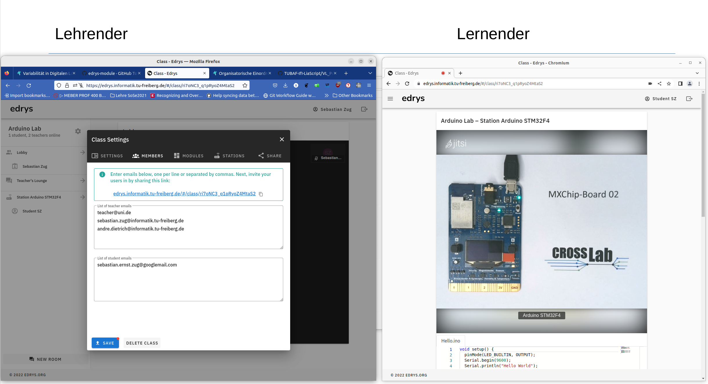

<!--
author:   Sebastian Zug, André Dietrich
email:    sebastian.zug@informatik.tu-freiberg.de & andre.dietrich@informatik.tu-freiberg.de

version:  0.0.1
language: en
narrator: UK English Female

icon:     https://cross-lab.org/content/images/2021/11/Logo-mit-5-mehrfarbig.png

<span style="color:red">@0</span>

-->

[](https://liascript.github.io/course/?https://raw.githubusercontent.com/Cross-Lab-Project/presentations/main/HDF_CommunityGroup_2022/CWG_Presentation.md#1)

# Variabilität in Digitalen Laboren
<h2>Motivation und Stand des Vorhabens CrossLab </h2>

<div style="width: 34%; float: left">

| Partner                  |
|--------------------------|
| TU Bergakademie Freiberg |
| TU Ilmenau               |
| TU Dortmund              |
| Nordakademie             |

</div>

<!-- style="width: 65%; float: right" -->

<h5><p>Meeting Community Working Group</p><p>„Digitale Labore“</p>9. Dezember 2022</h5>

<h5> </h5>


## CrossLab-Motivation

")<!-- style="width: 90%; display: block; margin-left: auto; margin-right: auto;"-->

> __Mal schnell die Aufgaben anpassen oder neue Beispiele einfügen - Nur für Experten.__

## Cross-X

```ascii


                            +--------------------------------------------------------+
         +-->    elements   | composition of varying laboratory objects              |
         |                  +--------------------------------------------------------+
         |
         |                  +--------------------------------------------------------+
         +-->       types   | mixture of different types of laboratories             |
         |                  +--------------------------------------------------------+
CROSS ---+
         |                  +--------------------------------------------------------+
         +--> disciplinary  | sharing laboratories between different disciplines     |
         |                  +--------------------------------------------------------+
         |
         |                  +--------------------------------------------------------+
         +-->   university  | formation of a laboratory cluster                      |
                            +--------------------------------------------------------+


```
[1] Aubel et al, _Adaptable Digital Labs -Motivation and Vision of the CrossLab Project_, GECON 2022, [Link](https://www.researchgate.net/publication/365384986_Adaptable_Digital_Labs_-Motivation_and_Vision_of_the_CrossLab_Project)

### Challenges

```ascii

                             .--------------.   .--------------.   .--------------.
                             | technical    |   | didactical   |   |organisational|
                             |              |   |              |   |              |
                            +--------------------------------------------------------+
         +-->    elements   | composition of varying laboratory objects              |
         |                  +--------------------------------------------------------+
         |                   |              |   |              |   |              |
         |                  +--------------------------------------------------------+
         +-->        types  | mixture of different types of laboratories             |
         |                  +--------------------------------------------------------+
CROSS ---+                   |              |   |              |   |              |
         |                  +--------------------------------------------------------+
         +->  disciplinary  | sharing laboratories between different disciplines     |
         |                  +--------------------------------------------------------+
         |                   |              |   |              |   |              |
         |                  +--------------------------------------------------------+
         +-->   university  | formation of a laboratory cluster                      |
                            +--------------------------------------------------------+
                             |              |   |              |   |              |
                             .--------------.   .--------------.   .--------------.
```

### Requierments

```ascii


                              |  technical     |  didactical     |  organisational
                 -------------+----------------+-----------------+------------------
                              | data exchange, | adjustment of   |
         +-->       elements  | real-time      | system recon-   |
         |                    | behaviour      | figuration      | digital skills
         |       -------------+----------------+ and intended    | of lecturers
         |                    | individual     | didactical      |
         +-->           type  | interfaces     | learning        |
         |                    | composability  | outcomes        |
CROSS ---+       -------------+----------------+-----------------+------------------
         |                    | remote re-     | specific        | access planning,
         +-->    disciplinary | configura-     | learning per-   | physical re-
         |                    | bility         | spectives       | configuration
         |       -------------+----------------+-----------------+ privacy,
         |                    | student access | differnt didac- | maintance and
         +-->      university |                | tical profiles  | monitoring
                              |                | and formalisms  |
                 -------------+----------------+-----------------+------------------
```

## (Re-)konfigurierbare Labore mit Edrys

                                      {{0-1}}
*****************************************************************************************

> Elemente der Umsetzung eines Remote-Labors

```ascii

    Laborebene      .                                                      Lernendensicht
                    .
    n Instanzen     .                                                      m Instanzen
  
                                                                               .
          +-----------------+                 +-----------------+              .  
          |Instrumentierung |                 |Management       |              .
          +---------+       |                 +---------+       |   
 +----------------+ |       |        +----------------+ |       |      +----------------+         
 |eigentlicher    | |       |========|Gateway         | |       |======|Webbrowser      |              
 |Laborgegenstand | |       |        |                | |       |      |                |     
 +----------------+ |       |        +----------------+ |       |      +----------------+   
          +---------+       |                 +---------+       |      Studentischer Rechner
          |                 |                 |                 |
          +-----------------+                 +-----------------+              .
                                                                               .
                    .                                                          .
                    .
                    .
        

```

*****************************************************************************************


                                           {{1-2}}
*****************************************************************************************

> Realisierung mittels zentraler Serverarchitektur


```ascii

    Laborebene                    Monolitische                             Lernendensicht
                              Server-Infrastruktur
    n Instanzen       .-----------------------------------------.          m Instanzen
                      |                                         |
                                                                               .
          +-----------------+                 +-----------------+              .  
          |Instrumentierung |                 |Management       |              .
          +---------+       |                 +---------+       |   
 +----------------+ |       |        +----------------+ |       |      +----------------+         
 |eigentlicher    | |       |========|Gateway         | |       |======|Webbrowser      |              
 |Laborgegenstand | |       |        |                | |       |      |                |     
 +----------------+ |       |        +----------------+ |       |      +----------------+   
          +---------+       |                 +---------+       |      Studentischer Rechner
          |                 |                 |                 |
          +-----------------+                 +-----------------+              .
                                                                               .
                    .                                                          .
                    .
                    .
        

```

*****************************************************************************************

                                       {{2-3}}
*****************************************************************************************

> _Teile und Herrsche_ am Beispiel eines Remote-Labors

```ascii

                                                      bestehende
                                                 Modulimplementierungen                              
                                                      aus dem Netz     
                                                           |
                                                           v                   .
          +-----------------+                 +-----------------+              .  
          |Instrumentierung |                 |Management       |              .
          +---------+       |                 +---------+       |   
 +----------------+ |       |        +----------------+ |       |      +----------------+         
 |eigentlicher    | |       |========|Gateway         | |       |======|Webbrowser      |              
 |Laborgegenstand | |       |        |                | |       |      |                |     
 +----------------+ |       |        +----------------+ |       |      +----------------+   
          +---------+       |                 +---------+       |      Studentischer Rechner
          |                 |                 |                 |
          +-----------------+                 +-----------------+              .
                                                                               .

          |                                 | |                   |
          .---------------------------------. .-------------------.
                    Edrys Station                Edrys Classroom
                    PC im Browser!                    Server
                          ^                       +-----------+    Klassenraum   
                          |                       | * ...     |\    konfiguration  
                          |                       | * ...     +-+    
                          |                       | * Modul 1   |    
                          |                       | * Modul 2   | 
                          |                       |             | 
                          |                       |             |            
                          +-----------------------| * Station 0 |            
                                                  | * ...       |
                                                  +-------------+
                                                       .yaml
                                                       .json

```

*****************************************************************************************


### Existierende Module und Stationen

| Module                                         | Klassenräume                                          |
|------------------------------------------------|-------------------------------------------------------|
| Kollaboration (Chat, Video Call)               | Mikrocontroller (basierend auf der arduino-cli)       |
| Interaktion (Whiteboard, Editoren)             | Programmierumgebungen für diverse Sprachen            |
| Input/Output (Videostream, Konsole)            |                                                       |
| Lehrmaterialien (LiaScript)                    |                                                       |
| [Link](https://github.com/topics/edrys-module) | [Link](https://github.com/Cross-Lab-Project/openLabs) |


### Demonstration

```ascii 
                                           (LiaScript Aufgabenstellung)
                                                       | 
                                                       v
                                              +-----------------+                
                                              |Edrys Server     |             
                                              +---------+       |   
 +----------------+   USB            +----------------+ |       |      +----------------+         
 |Mikro           |==================|Shell Modul mit | |       |======|Webbrowser      | 
 |controller      |                  |arduino-cli     | |       |      |                |     
 +----------------+                  +----------------+ |       |      +----------------+   
                                              +---------+       |      Studentischer Rechner
                                              |                 |
                                              +-----------------+              
                                                                               

          |                                 |
          .---------------------------------. 
                    Edrys Station    
                     Classroom                                                     

```

```yaml -MicrocontrollerLab.config -
id: 331sMLT-Mg-Xc_ArGz2Xm
createdBy: sebastian.zug@informatik.tu-freiberg.de
dateCreated: 1669974555366
name: Arduino Lab
members:
  teacher:
    - teacher@uni.de
    - sebastian.zug@informatik.tu-freiberg.de
    - andre.dietrich@informatik.tu-freiberg.de
  student:
    - sebastian.ernst.zug@googlemail.com
modules:
  - url: https://cross-lab-project.github.io/module-video-chat-jitsi/
    config:
      instance: https://meet.jit.si
      config: '&config.startWithAudioMuted=true'
    studentConfig:
      config: '&config.startWithVideoMuted=true&stud'
    teacherConfig:
      config: '&config.startWithVideoMuted=true&teach'
    stationConfig:
      config: '&config.startWithVideoMuted=false&station'
    width: full
    height: tall
  - url: https://cross-lab-project.github.io/edrys_module-editor/index.html
    config:
      file:
        Hello.ino: |
          void setup() {
            pinMode(LED_BUILTIN, OUTPUT);
            Serial.begin(9600);
            Serial.println("Hello World");
          }

          void loop() {
            digitalWrite(LED_BUILTIN, HIGH);
            delay(1000);           
            digitalWrite(LED_BUILTIN, LOW);
            delay(1000);
          }
      runCommand: execute
      language: cpp
      theme: light
    studentConfig: ''
    teacherConfig: ''
    stationConfig: ''
    width: full
    height: tall
  - url: https://cross-lab-project.github.io/edrys_module-pyxtermjs/index.html
    config: ''
    studentConfig: ''
    teacherConfig: ''
    stationConfig:
      server: http://localhost:5000/pty
      execute: execute
      script: |
        arduino-cli sketch new Hello
        olddir=$(pwd)

        mv Hello.ino Hello
        cd Hello

        arduino-cli board attach -b AZ3166:stm32f4:MXCHIP_AZ3166
        arduino-cli compile
        arduino-cli upload
        arduino-cli monitor -p /dev/ttyACM0
        cd $olddir
      enable:
        teacher: true
        student: true
    width: full
    height: tall
```




## Thanks for your interest

> Die im Rahmen dieser Präsentation gezeigte Demo basiert auf den Arbeiten von André Dietrich, Karl Fessel und der edrys Community.

| Reference          | Link                                                                         |
|--------------------|------------------------------------------------------------------------------|
| Project website    | [https://cross-lab.org/](https://cross-lab.org/)                             |
| Project repository | [https://github.com/Cross-Lab-Project](https://github.com/Cross-Lab-Project) |
| Edrys repository   | [https://edrys.org/](https://github.com/Cross-Lab-Project/edrys)             |

> ___CrossLab_ is founded by Stiftung Innovation in der Hochschullehre [Link](https://stiftung-hochschullehre.de/projekt/crosslab/).__
