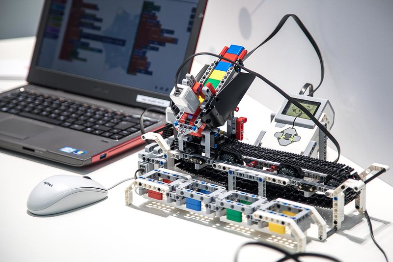
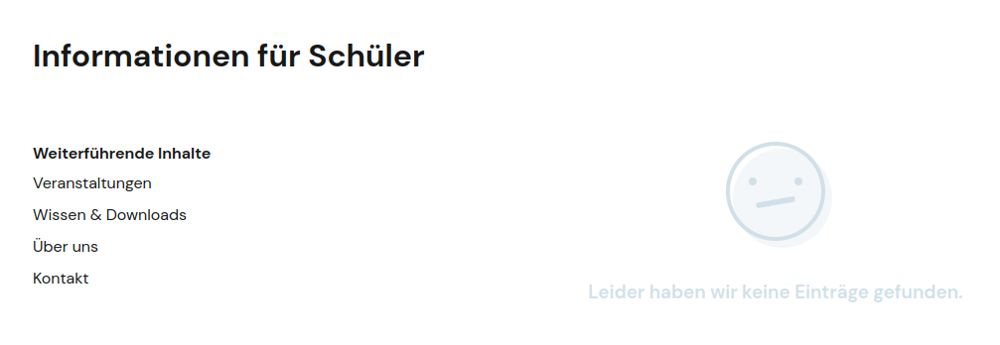

<!--

author:   Sebastian Zug, André Dietrich
email:    sebastian.zug@informatik.tu-freiberg.de
version:  1.0.6
language: de
repository: 
narrator: Deutsch Female
comment:  Diskussion potentieller Konzepte eines Antrages zur Implementierung von OER und Digitalen Laboren in einem schulübergreifenden Verbund
tags:      
logo:     

import: https://github.com/liascript/CodeRunner
        https://github.com/LiaTemplates/PeriodicTable/blob/main/README.md

-->

[](https://liascript.github.io/course/?https://raw.githubusercontent.com/Cross-Lab-Project/presentations/main/MINT_2023/presentation.md#1)

# MINTopen Cluster - Projektvorstellung

<h2>Herzlich Willkommen!</h2>

| Parameter                | Kursinformationen                                                                                    |
| ------------------------ | ---------------------------------------------------------------------------------------------------- |
| **Veranstaltung:**       | `Perspektiven eines Antrages zur Dritte Förderrichtlinie zu MINT-Clustern`                           |
| **Hochschule:**          | `TU Bergakademie Freiberg`                                                                           |
| **Inhalte:**             | @comment                                                                                             |
| **Repository**           | [https://github.com/Cross-Lab-Project/presentations/tree/main/MINT_2023](https://github.com/Cross-Lab-Project/presentations/tree/main/MINT_2023)                                            |
 

---------------------------------------------------------------------

Prof. Dr. Sebastian Zug, Dr. André Dietrich

Technische Universität Bergakademie Freiberg

Mai 2023

---------------------------------------------------------------------

<!--  style = "background-color: #F0F2F6; color:black; padding: 10px 10px 5px 10px; margin-bottom: 10px" -->
<div>**Lizenzhinweis**


<!-- style = "text-align:center;" -->

Dieses Material ist – sofern nicht anders an einzelnen Objekten ausgewiesen – lizenziert unter der Lizenz [CC BY 4.0](https://creativecommons.org/licenses/by/4.0/legalcode) (Logos ausgenommen). Das Material selbst finden Sie unter oben genanntem Link.<br>
</div>

## Motivation

                               {{0-1}}
*************************************************************************

Bestehende MINT-Cluster
------------------------

<!--
      width = "600px"
    -->

<!-- data-type="none" -->
| Sächsische Cluster | Standort | Laufzeit | 
|-----|-----|-----|
| [MINT-Aktiv](https://mint-aktiv.com/)  | Leipzig |  12.2020 - 11.2023 |
| [MINTsportRERION](https://www.solaris-fzu.de/projekte/schule-und-ausbildung/mint-sportregion.html)    | Chemnitz|  08.2022 - 07.2025 (ggf. Juli 2027) |
| [MINOS](https://minos-macht-schlau.de/) | Ostsachsen (Bautzen)|  01.2021 - 12.2023 | 

*************************************************************************

                               {{1-2}}
*************************************************************************

Aktuelle Ausschreibung
------------------------

> _" ... Klimawandel und Digitalisierung zu meistern ... . Deshalb wollen wir die Anzahl der MINT-Cluster mit einem zusätzlichen Förderwettbewerb weiter ausbauen. ... Jetzt sollen 15 bis 20 weitere Cluster hinzukommen ..._" (Pressemittlung BMBF 18/2023)

> _"... Regelmäßige MINT-Angebote sollen durch die Förderung von MINT-Clustern soselbstverständlich werden wie der Besuch des Sportvereins oder der Musikschule. ..."_ (Ausschreibung BANZ 6.03.2023)

<iframe src="https://www.bildung-forschung.digital/digitalezukunft/de/bildung/mint-cluster/mint-cluster-iii/mint-cluster-iii_node.html
" width="900" height="400" name="SELFHTML_in_a_box">
</iframe>

*************************************************************************

[^MINT_Cluster_BMBF]: Webseite des BMBF - https://www.bildung-forschung.digital/digitalezukunft/de/bildung/mint-cluster/mint-cluster_node.html

## Herausforderungen der Lehre für MINT Themen

> _"MINT lebt vom interaktiven Erleben und der praktischen Anwendung."_

...  nur ergeben sich dabei erhebliche Herausforderungen:

1. Aufwändige physische Realsierungen in Form von Laborinstallationen
2. Aufwändige Vorbereitungen im IT Kontext (Installation von Schülerrechnern)
3. Aufwändige Aufbereitung der Inhalte in begleitenden Materialien

... wobei die Materialien aber nur in sehr eingeschränkten Zeitfenstern zur Verfügung stehen.



                               {{1-2}}
*************************************************************************

> An dieser Stelle werden seit Jahren zwei Lösungsansätze beschrieben
>
> + Digitalisierung / Virtualisierung der Lehre
> + außerschulische Angebote für praktische Erfahrungen

*************************************************************************

[^2]: Forum Digitalisierung - LEARNTEC 2018, Karlsruhe [https://www.flickr.com/photos/160200532@N02/](https://www.flickr.com/photos/160200532@N02/)

### Ansatz 1 - Digitalisierung

> _"Da muss ich ja Informatik studiert haben und sehr viel Zeit mitbringen."_ (Pädagoge bei OER Demonstration)

| Animal          | weight in kg | Lifespan years |
| --------------- | ------------:| --------------:|
| Mouse           |        0.028 |              2 |
| Flying squirrel |        0.085 |             15 |
| Brown bat       |        0.020 |             30 |
| Sheep           |           90 |             12 |
| Human           |           68 |             70 |

@PeriodicTable

```python  Greetings.py
mint = ["Mathematik", "Informatik", "Naturwissenschaft", "Technik"]

for topic in mint:
  print(f"{topic} ", end="")

print("... sind hier gefragt!")
```
@LIA.eval(`["main.py"]`, `none`, `python3 main.py`)

### Ansatz 2 - außerschulische Angebote

> _"Da gehe ich nicht hin, da treffen sich ja nur die Nerds."_ (Schüler 7. Klasse)

Allein die Übersicht der in den MINT-Clustern geförderten Projekte dokumentieren ein großes Engagement und Erfolg der Beteiligten. Allerdings bleibt der Eindruck einer "Geschlossenheit" der Angebote.



## Potentielle Leitlinien des Antrags

> **Vision 1**: Die Herausforderungen einer zeitgemäßen MINT Lehre lassen sich nur in schulübergreifenden Verbünden von Lehrenden lösen. 
>
> **Vision 2**: Die MINT Lehre braucht neue Konzepte der Verzahnung zwischen traditionellen Formaten und digitalen Elementen.
>
> **Vision 3**: MINT Lehre muss die unterschiedlichen Lerngeschwindigkeiten der Kinder und Jugendlichen bei der Arbeit mit praktischen Elementen berücksichtigen. 


TODO Grafik einfügen

                    {{1-2}}
********************************************************************

**Lösungsansatz 1 - Offen Materialien**

Es verlangt niemand, dass jede Pädagogin und jede Pädagogin alle Aspekte eines Materials selbst umsetzen. Vielmehr sollten sie existierende Materialien anpassen und mit Blick auf ein spezifisches didaktisches Ziel aufwerten - Hochschullehrern geht es auch so :-)

")

> Lösungskontext 1 - Verwendung von OER - Materialien, die bedarfsgerecht und im Unterricht und darüber hinaus genutzt werden könenn.

<details>
<summary>Exkurs OER Visionen</summary>

>  **Open Courseware / Open Educational Resources** ... teaching, learning and
> research materials in any medium, digital or otherwise,that reside in the
> **public domain** or have been released under an open license that permits
> no-cost access, use, **adaptation** and **redistribution** by others with no or 4
> limited restrictions. Open licensing is built within the existing framework of
> intellectual property rights as defined by relevant international conventions
> and respects the authorship of the work
>
> -- UNESCO 2002 Forum on the Impact of Open Courseware for Higher Education in Developing Countries [(Link)](https://unesdoc.unesco.org/ark:/48223/pf0000128515)

| Anforderung                  | Bedeutung                                  |
|------------------------------|--------------------------------------------|
| `verwahren/vervielfältigen ` | Download, Speicherung und Vervielfältigung |
| `verwenden`                  | Nutzung im Lernkontext                     |
| `verarbeiten`                | Umgestaltung und Adaption                  |
| `vermischen`                 | Kombination und Extraktion                 |
| `verbreiten`                 | (digitale) Publikation                     |
</details>

*_5 V-Freiheiten für Offenheit_ von Jöran Muuß-Merholz und Jörg Lohrer für [open-educational-ressources](https://open-educational-resources.de) - Transferstelle für OER*

********************************************************************

                    {{2-3}}
********************************************************************

**Lösungsansatz 2 - Offene Labore**

Ganzheitliche Konzepte zur Arbeit an MINT Themen, die digitale und "analoge" Elemente kombinieren, die eine hohe Verfügbarkeit und Bandbreite gewährleisten.

| Laborform | Beispiel    | Zeitkontext |
|-----|----|-- |
| außerschulische Angebote im Schulkontext | Lego Roboter | beschränkt |  
| Simulationen  | Arduino Roboter |  unbeschränkt | 
| universitäre Labore  als Remote-Labor | Einstiegs Roboterplattformen |  unbeschränkt |  
| Labore der Hochschule   | Outdoor Roboter der TUBAF |  beschränkt |  

********************************************************************

                    {{2-3}}
********************************************************************

**Lösungsansatz 3 - Robotik als Anwendungsfeld**

> Das Vorhaben fokussiert sich auf das Themenfeld Robotik und adressiert damit sowohl übergreifende MINT Fachgebiete als auch ein gesellschaftlich bedeutsames Feld. 

TODO Bilder roboter in Freiberg

********************************************************************


## Implementierungen und Demonstration

**Remote-Labor meets OER**[^CrossLab]


```ascii 
                                        +-----------+
                                        | * ...     |\    Konfiguration  
                                        | * ...     +-+    
                 Komponenten            | * Modul 1   |    
                 Aufgaben               | * Modul 2   |   .yaml
                 Lösungen für Lehrende  |             |   .json
                 Hilfestellungen        |             |            
                                        | * Station 0 |            
                                        | * ...       |
                                        +-------------+
                                               |
                                               v
                                      +-----------------+                
                                      |Edrys Server     |             
                                      +---------+       |   
 +----------------+   USB    +----------------+ |       |      +----------------+         
 |Mikro           |==========|Shell Modul mit | |       |======|Webbrowser      | 
 |controller      |          |arduino-cli     | |       |      |                |     
 +----------------+          +----------------+ |       |      +----------------+   
                                      +---------+       |      Rechner des Lernenden
                                      |                 |
                                      +-----------------+              
                                                                               
          |                          |
          .--------------------------. 
                 Edrys Station    
                  Classroom                                                     
```

Weitere Informationen unter:


[^CrossLab]: Aubel et al, _Adaptable Digital Labs -Motivation and Vision of the CrossLab Project_, GECON 2022, [Link](https://www.researchgate.net/publication/365384986_Adaptable_Digital_Labs_-Motivation_and_Vision_of_the_CrossLab_Project)

**RoboLab der TU Bergakademie**

An der Bergakademie wird ab August 2023 das RoboLab in einem Geschäft der Burgstraße eingerichtet.

TODO Bild einfügen

## Kernelemente des Antrages

1. Avisiertes Konsortium

    + Partner im Antragsverfahren:

      + Landkreis Mittelsachsen als Schulträger einiger der beteiligten Gymnasien
      + 
      + TU Bergakademie
    
    + Assoziierte Partner

      + Gymnasium im Bereich "Mittelsachsen"
      + Industrieunternehmen / IHK 

2. Beschaffung von Materialien für die an den Schulstandorten notwendigen Materialien 

3. Betreuung der Aktivitäten durch einen Bildungsträger / TU Bergakademie an den Standorten der Schulen 

## Ausblick

> Die im Rahmen dieser Präsentation gezeigte Demo basiert auf den Arbeiten von André Dietrich, Karl Fessel und der edrys Community.

| Reference          | Link                                                                         |
|--------------------|------------------------------------------------------------------------------|
| Projekt Website    | [https://cross-lab.org/](https://cross-lab.org/)                             |
| Project Repository | [https://github.com/Cross-Lab-Project](https://github.com/Cross-Lab-Project) |
| Edrys Repository   | [https://edrys.org/](https://github.com/Cross-Lab-Project/edrys)             |
| LiaScript          | [https://liascript.github.io/](https://liascript.github.io/)
