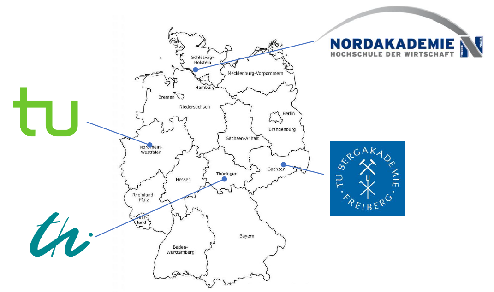

<!--
author:   Sebastian Zug, André Dietrich
email:    sebastian.zug@informatik.tu-freiberg.de & andre.dietrich@informatik.tu-freiberg.de

version:  0.0.1
language: en
narrator: UK English Female

icon:     https://cross-lab.org/content/images/2021/11/Logo-mit-5-mehrfarbig.png
-->

[](https://liascript.github.io/course/?https://raw.githubusercontent.com/Cross-Lab-Project/presentations/main/GeCon_2022_Adaptability/CrossLab_GeCon2022.md)

# D2C2 meets CrossLab
<h2>Vision of Cross-X in laboratory education</h2>

<div style="width: 46%; float: left">

+ TU Bergakademie Freiberg 
+ TU Ilmenau               
+ TU Dortmund              
+ Nordakademie Elmshorn            

</div>

<!-- style="width: 50%; float: right" -->

<div style="width: 100%; float: left">

<h5>Dresden, 19.03.2025</h5>

</div>

## CrossLab-Motivation

")<!-- style="width: 90%; display: block; margin-left: auto; margin-right: auto;"-->

> __How to characterize the implementation? It was hard coded related to components and content.__

## Cross-X

```ascii


                            +--------------------------------------------------------+
         +-->    elements   | composition of varying laboratory objects              |
         |                  +--------------------------------------------------------+
         |
         |                  +--------------------------------------------------------+
         +-->       types   | mixture of different types of laboratories             |
         |                  +--------------------------------------------------------+
CROSS ---+
         |                  +--------------------------------------------------------+
         +--> disciplinary  | sharing laboratories between different disciplines     |
         |                  +--------------------------------------------------------+
         |
         |                  +--------------------------------------------------------+
         +-->   university  | formation of a laboratory cluster                      |
                            +--------------------------------------------------------+

```

### Challenges

```ascii

                             .--------------.   .--------------.   .--------------.
                             | technical    |   | didactical   |   |organisational|
                             |              |   |              |   |              |
                            +--------------------------------------------------------+
         +-->    elements   | composition of varying laboratory objects              |
         |                  +--------------------------------------------------------+
         |                   |              |   |              |   |              |
         |                  +--------------------------------------------------------+
         +-->        types  | mixture of different types of laboratories             |
         |                  +--------------------------------------------------------+
CROSS ---+                   |              |   |              |   |              |
         |                  +--------------------------------------------------------+
         +->  disciplinary  | sharing laboratories between different disciplines     |
         |                  +--------------------------------------------------------+
         |                   |              |   |              |   |              |
         |                  +--------------------------------------------------------+
         +-->   university  | formation of a laboratory cluster                      |
                            +--------------------------------------------------------+
                             |              |   |              |   |              |
                             .--------------.   .--------------.   .--------------.
```

### Requierments

```ascii


                              |  technical     |  didactical     |  organisational
                 -------------+----------------+-----------------+------------------
                              | data exchange, | adjustment of   |
         +-->       elements  | real-time      | system recon-   |
         |                    | behaviour      | figuration      | digital skills
         |       -------------+----------------+ and intended    | of lecturers
         |                    | individual     | didactical      |
         +-->           type  | interfaces     | learning        |
         |                    | composability  | outcomes        |
CROSS ---+       -------------+----------------+-----------------+------------------
         |                    | remote re-     | specific        | access planning,
         +-->    disciplinary | configura-     | learning per-   | physical re-
         |                    | bility         | spectives       | configuration
         |       -------------+----------------+-----------------+ privacy,
         |                    | student access | differnt didac- | maintance and
         +-->      university |                | tical profiles  | monitoring
                              |                | and formalisms  |
                 -------------+----------------+-----------------+------------------
```

## Thanks for your interest

| Reference          | Link |
|--------------------|------|
| Project website    | [https://cross-lab.org/](https://cross-lab.org/) |
| Project repository |[https://github.com/Cross-Lab-Project](https://github.com/Cross-Lab-Project) |
| Edrys repository   | [https://edrys.org/](https://edrys.org/)|

> ___CrossLab_ is founded by Stiftung Innovation in der Hochschullehre [Link](https://stiftung-hochschullehre.de/projekt/crosslab/).__
