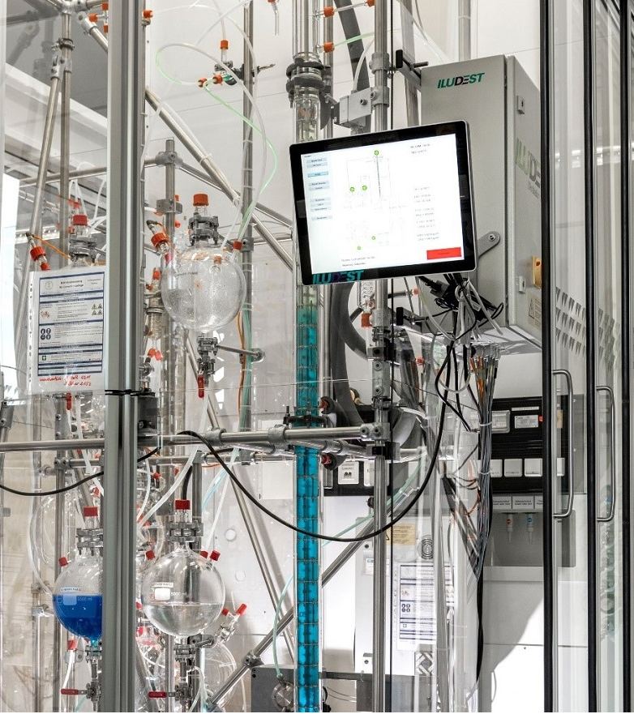
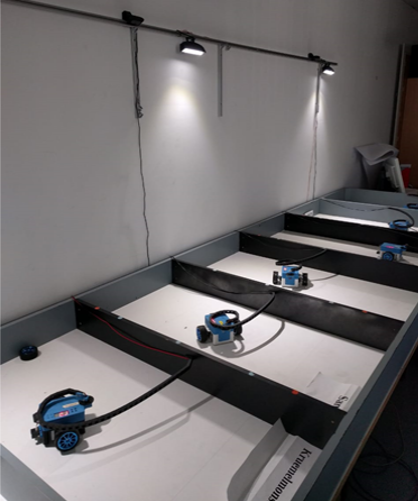
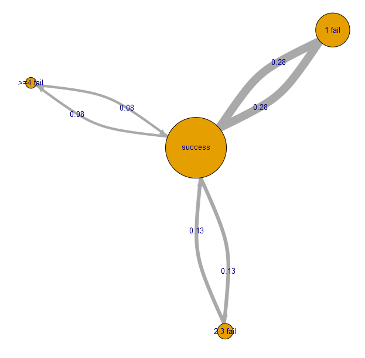

<!--
author:   Sebastian Zug; André Dietrich

email:    sebastian.zug@informatik.tu-freiberg.de

version:  0.1.2

language: de

narrator: UK English Female

icon:     https://media.aubi-plus.com/institution/thumbnail/3f3de48-technische-universitaet-bergakademie-freiberg-logo.jpg

link:     style.css

import:   https://raw.githubusercontent.com/liaTemplates/ABCjs/main/README.md
          
          https://raw.githubusercontent.com/liaTemplates/TextAnalysis/main/README.md
          https://raw.githubusercontent.com/LiaScript/CodeRunner/master/README.md
          https://raw.githubusercontent.com/LiaTemplates/LiveEdit-Embeddings/refs/tags/0.0.1/README.md

@style
.flex-container {
    display: flex;
    flex-wrap: wrap; /* Allows the items to wrap as needed */
    align-items: stretch;
    gap: 20px; /* Adds both horizontal and vertical spacing between items */
}

.flex-child { 
    flex: 1;
    margin-right: 20px; /* Adds space between the columns */
}

@media (max-width: 600px) {
    .flex-child {
        flex: 100%; /* Makes the child divs take up the full width on slim devices */
        margin-right: 0; /* Removes the right margin */
    }
}
@end

-->

[](https://liascript.github.io/course/?https://raw.githubusercontent.com/Cross-Lab-Project/presentations/main/Werkstattpause_2025/presentation.md#1)

# Edrys Framework für die Entwicklung von digitalen Laboren

<h2>Konzepte und Erfahrungen des CrossLab-Projektes </h2>

<div style="width: 34%; float: left">

| Partner                  |
|--------------------------|
| TU Bergakademie Freiberg |
| TU Ilmenau               |
| TU Dortmund              |
| Nordakademie             |

</div>

<!-- style="width: 60%; float: right" -->

<h5>
<p>Dr. Ines Aubel, Dr. Andre Dietrich, Prof. Dr. Sebastian Zug</p>
<p>Werkstatt & Laborpause</p>
<p>Januar 2025</p>
</h5>

<div>

---

> Dieser Vortrag ist eine Open Educational Resource (OER) und steht unter der Lizenz [CC BY 4.0](https://creativecommons.org/licenses/by/4.0/deed.de). Alle enthaltenen Inhalte können frei verwendet werden und sind unter https://github.com/Cross-Lab-Project/presentations/tree/main/Werkstattpause_2025 verfügbar

</div>

## Ausgangspunkt: Digitale Lehre
 
[LiaScript](https://liascript.github.io/) wird seit 2017 als Open Source Lernplattform für die digitale Lehre an der TU Bergakademie Freiberg gemeinsam mit einer internationalen Community entwickelt wird.

> Aufruf des Live-Editors, der lokal in Ihrem Browser läuft, mit https://liascript.github.io/LiveEditor/

                               {{0-1}}
*************************************************************************

```markdown @embed.style(height: 550px; min-width: 100%; border: 1px black solid)
# Vom Text zur Darstellung

__Mathematik__

$f(x) = x^2$

__Tabellen__

| X | B(y) | C(y) |
|---|:----:|:----:|
| 1 |   2  |   3  |
| 4 |   5  |   6  |

__Sprache__

> Click to run!
>
> {{|> Deutsch Female}}
> Markdown ist eine vereinfachte Auszeichnungssprache, die der Ausgangspunkt unserer Entwicklung von LiaScript war.
```

*************************************************************************

                               {{1-2}}
*************************************************************************

````markdown @embed.style(height: 550px; min-width: 100%; border: 1px black solid)

<!--
import: https://raw.githubusercontent.com/liaTemplates/AVR8js/main/README.md
-->

# Simulation von Hardware

<div id="example">
<wokwi-led color="red"   pin="13" label="13"></wokwi-led>
<wokwi-led color="green" pin="12" label="12"></wokwi-led>
<wokwi-led color="blue"  pin="11" label="11"></wokwi-led>
<wokwi-led color="blue"  pin="10" label="10"></wokwi-led>
<span id="simulation-time"></span>
</div>

``` cpp
byte leds[] = {13, 12, 11, 10};
void setup() {
  Serial.begin(115200);
  for (byte i = 0; i < sizeof(leds); i++) {
    pinMode(leds[i], OUTPUT);
  }
  Serial.print("Running Led started ... ");
}

int i = 0;
void loop() {
  digitalWrite(leds[i], HIGH);
  delay(250);
  digitalWrite(leds[i], LOW);
  i = (i + 1) % sizeof(leds);
}
```
@AVR8js.sketch(example)
````

*************************************************************************

### ... ja aber ...

<section class="flex-container">

<div class="flex-child" style="min-width: 250px;">

> __Lehre im naturwissenschaftlich / technischen Kontext lebt von der Interaktion mit realen Systemen!__

</div>

<div class="flex-child" style="min-width: 250px;">

<!-- width="80%" -->

</div>

</section>

### Remote-Labor Vision

> Das Konzept der Remote-Labore verschmit die Vorteile der digitalen Lehre mit den Vorteilen der praktischen Laborarbeit.

Erstes "eigenes" Remote-Labor 2019

")
")


!?[Industrial eLab - Demo](https://www.youtube.com/watch?v=bICfKRyKTwE "eLab - Labor mit Fernzugriff an der Otto-von-Guericke-Universität Magdeburg")

<!-- class="highlight" -->
> __Projekt:__ [Industrial eLab Projekt - Industrial eLab](https://www.wihoforschung.de/wihoforschung/de/bmbf-projektfoerderung/foerderlinien/forschung-zur-digitalen-hochschulbildung/erste-foerderlinie-zur-digitalen-hochschulbildung/industrial-elab/industrial-elab_node.html), BMBF (2017-2020), Otto-von-Guericke Universität Magdeburg


### Konzeptionelle Nachteile der Lösungen

")<!-- style="width: 70%; display: block; margin-left: auto; margin-right: auto;"-->

> __Herausforderung 1: Fehlende Flexibilität__ - Aufgaben anpassen oder neue Beispiele einfügen - Nur für Experten

> __Herausforderung 2: Beschränkte Nutzung__ - in einzelnen Phasen des Jahres wurde das Labor äußerst intensiv genutzt, während es in anderen kaum Anwendung fand

> __Herausforderung 3: Beschränkte Sicht__ - der Fokus der Umsetzung lag vollständig auf Remote-Laboren. Andere digitale Formate wurden nicht berücksichtigt.

## Digitale Labore als OER

Lösungsansätze:

+ Trennung zwischen tatsächlichen Lerninhalte und technischer Umsetzung  
+ Kombination unterschiedlicher digitaler Formate (Simulation, Videos, Remote-Labore, ...)
+ Integration anpassbarer / wiederverwendbare Materialien
+ Offene Nutzungskonzepte 
+ Kollaborative Entwicklung mit verschiedenen Autoren
+ ...
$\sum = $ Digitale Labore als offene Bildungsressourcen (OER)

> __Ziel 1__ - Textbasierte Konfiguration digitaler Labore

> __Ziel 2__ - Serverlose Infrastruktur


### Ziel 1: Textbasierte Konfiguration

     {{0-1}}
<section>

> Traditionelle Laborrealisierungen sind monolithisch und schwer anpassbar.

``` ascii

  Laboratory Level                   Monolithic
                          Server-Infrastructure          Learner's View
  n Instances   .--------------------------------.
                |                                |         m Instances 
                                                                 .
      +-----------------+         +-----------------+            .  
      | Instrumentation |░        |    Management   |░           .
      +--------.        |░        +--------.        |░  
 +-----------+  \       |░   +-----------+  \       |░   +----------------+
 | 👩🏻‍🔬 Actual  \  \      |--->|  Gateway   \  \      |--->|  Web Browser   |
 | Laboratory /  /      |<---|     🖥     /  /      |<---|      🧑‍💻        |
 +-----------+  /       |░   +-----------+  /       |░   +----------------+
      +--------'        |░        +--------'        |░   Student's Computer
      |                 |░        |                 |░
      +-----------------+░        +-----------------+░           .
        ░░░░░░░░░░░░░░░░░░          ░░░░░░░░░░░░░░░░░░           .
                   .                                             .
                   .
                   .                                             
```

<!-- class="reference" -->
> __Reference:__
> Ines Aubel et al
> _Adaptable Digital Labs - Motivation and Vision of the CrossLab Project_
> GeCon 2022
> [Link](https://www.researchgate.net/publication/365384986_Adaptable_Digital_Labs_-Motivation_and_Vision_of_the_CrossLab_Project)

</section>

        {{1-2}}
<section>

```ascii

            Existing                         Learning Scenario              
     Module Implementations                    Configuration             
         from the Web                           (from web)                   
               |                                     |         
               +------------------+------------------+    
                                  |
                                  v             
                        +-----------------+    
                        | Browser based   |░   
                        | Lab control     |░        
                        +--------.        |░     
                   +-----------+  \       |░
                   | 👩🏻‍🔬 Actual  \  \      |-->  
                   | Laboratory /  /      |<--
                   +-----------+  /       |░      
                        +--------'        |░      
                        |                 |░   
                        +-----------------+░              .
                          ░░░░░░░░░░░░░░░░░░              .

```


| [Modules](https://github.com/topics/edrys-module) | [Classrooms](https://github.com/Cross-Lab-Project/openLabs) |
| ------------------------------------------------- | ----------------------------------------------------------- |
| Collaboration (Chat, Video Call)                  | Micro-controller (based on arduino-cli)                     |
| Interaction (Whiteboard, Editors)                 | Programming environments for various languages              |
| Input/Output (Video stream, Console)              |                                                             |
| Teaching Materials (LiaScript)                    |                                                             |


</section>


        {{1-2}}
<section>

```` yaml   edrys_arduino_example.yaml
id: 867h9k2xYapYq324ezDQX
createdBy: andredietrich@web.de
dateCreated: 1683560033614
name: Arduino Kurs
members:
  teacher:
    - andre.dietrich@informatik.tu-freiberg.de
    - sebastian.zug@informatik.tu-freiberg.de
    - test@web.de
    - andredietrich@web.de
  student: []
modules:
  - url: https://cross-lab-project.github.io/edrys_module-markdown-it/index.html
    config: >-
      # Was ist Arduino?


      Arduino ist eine Open-Source-Plattform für Elektronik-Projekte, die aus
      einer einfachen Hardware und einer benutzerfreundlichen Software besteht.

    showInCustom: lobby
    width: full
    height: tall
    ....  
````

</section>

        {{1-2}}
> __Demo__: Konfigurierbare Mikrocontroller Remote-Labore ...

### Ziel 2: Serverlose Infrastruktur

> Remote-Labore sind in der Regel serverbasiert und benötigen eine aufwendige Infrastruktur.

``` ascii
Bisheriges Serverbasiertes -Setup              Server-lose Peer-to-Peer Umsetzung
                          
      👨🏾‍💻 --.     .-- 👩‍💻                          - - - --👨🏾‍💻-----👩‍💻    
            \   /                                              /  \ 
                                                              /    \     
  👩‍💻 ------  🖥️  ------ 👨🏾‍💻                           👩‍💻------+-----👨🏾‍💻- - -    
                                                       \    /      /   
            /   \                                       \  /      /    
      👨🏾‍💻 --'     '-- 👩‍💻                                  👨🏾‍💻     👩‍💻- - - -    
```

> __Demo__: Konfigurierbare Mikrocontroller Remote-Labore für alle!


## Weiterführende Informationen

                      {{0-1}}
***********************************************************

__Links auf die Implementierungen__

| Reference                 | Link                                                             |
| ------------------------- | ---------------------------------------------------------------- |
| Crosslab Projekt Webseite | [https://cross-lab.org/](https://cross-lab.org/)                 |
| Edrys Repository          | [https://edrys.org/](https://github.com/Cross-Lab-Project/edrys) |
|                           | [https://edrys.org/](https://github.com/Cross-Lab-Project/edrys) |
| LiaScript                 | [https://LiaScript.github.io](https://LiaScript.github.io)       |

__Kontinuierlich laufende Beispiellabore__

+ Einführung Mikrocontroller: https://edrys-labs.github.io/?/classroom/Ri1DZZcHzTzv5y15
+ Analog Digitalwandler: https://edrys-labs.github.io/?/classroom/MOy80MsaTmmd41yF#comm=ws
+ Interrupts und Timer: https://edrys-labs.github.io/?/classroom/sEHRNUR9TnhA8wYs

***********************************************************

                      {{1-2}}
***********************************************************


__Ansprechpartner an der TU Bergakademie Freiberg__

| Name                    | E-Mail-Adresse                           |
| ----------------------- | ---------------------------------------- |
| Dr. Ines Aubel          | Ines.Aubel@chemie.tu-freiberg.de         |
| Dr. André Dietrich      | Andre.Dietrich@informatik.tu-freiberg.de |
| Prof. Dr. Sebastian Zug | Sebastian.Zug@informatik.tu-freiberg.de  |


<!-- class="highlight" -->
> __Project:__
> [Crosslab](https://stiftung-hochschullehre.de/projekt/crosslab/) - Flexibel kombinierbare Cross-Reality Labore in der Hochschullehre: zukunftsfähige Kompetenzentwicklung für ein Lernen und Arbeiten 4.0, Stiftung Innovation in der Hochschullehre (2021 - 2025) - TU Bergakademie Freiberg, TU Illmenau, TU Dortmund, Nordakademie

***********************************************************